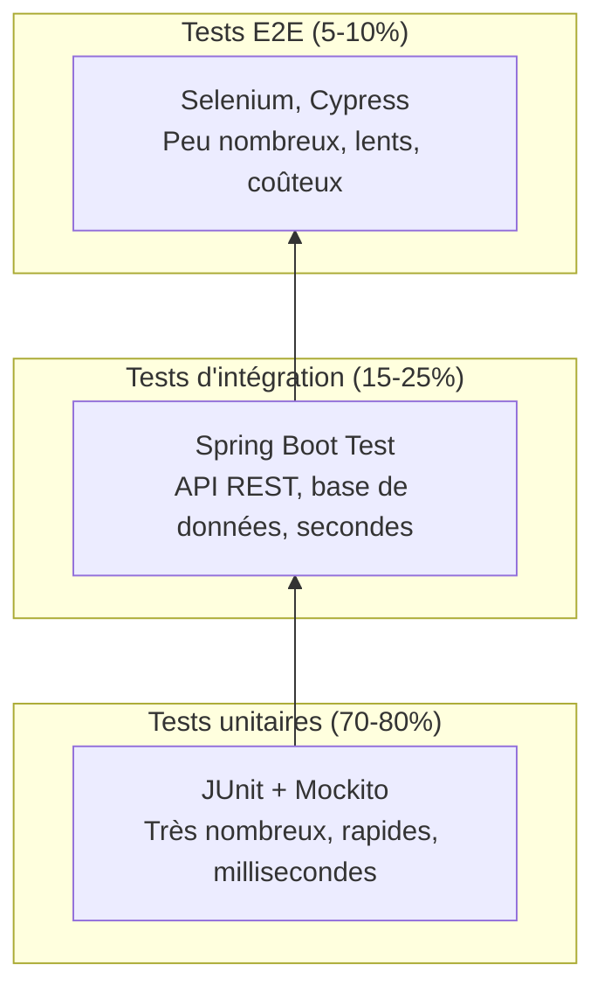
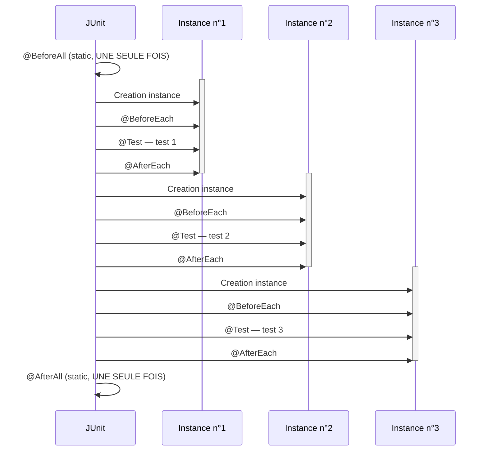

# Module 1 : Fondamentaux des Tests Unitaires avec JUnit 5

**Durée : 1h30 (9h00–10h30)**

---

## Objectifs pédagogiques

À l'issue de ce module, vous serez capable de :

1. **Définir** ce qu'est un test unitaire et le situer dans la pyramide des tests.
2. **Expliquer** l'architecture de JUnit 5 (Platform, Jupiter, Vintage) et la structure d'un projet Maven de test.
3. **Écrire** des tests unitaires avec l'annotation `@Test` en respectant le pattern AAA (Arrange, Act, Assert).
4. **Utiliser** les assertions fondamentales de JUnit 5 : `assertEquals`, `assertTrue`, `assertFalse`, `assertNull`, `assertNotNull`, `assertThrows`, `assertAll`, `assertArrayEquals`.
5. **Comprendre** le cycle de vie d'une classe de test (`@BeforeAll`, `@BeforeEach`, `@AfterEach`, `@AfterAll`) et justifier l'isolation des tests.
6. **Décortiquer** un fichier `pom.xml` Maven dédié aux tests, en identifiant le rôle de chaque plugin.
7. **Exécuter** les tests via Maven (`mvn clean test`) et interpréter les résultats.

---

## Prérequis

- **Java** : maîtrise des bases du langage (classes, méthodes, types primitifs, exceptions, collections).
- **Maven** : compréhension du rôle d'un `pom.xml`, des commandes `mvn compile` et `mvn package`.
- **IDE** : savoir créer un projet Maven et exécuter une classe Java.

---

## PARTIE 1 -- THEORIE (45 min)

---

## 1.1 Qu'est-ce qu'un test unitaire ?

### Définition

Un **test unitaire** est un morceau de code qui vérifie qu'une **unité** de code (une méthode, une classe) se comporte correctement de manière **automatisée, isolée et répétable**.

Autrement dit : au lieu de lancer votre application et de cliquer partout pour verifier que tout fonctionne, vous ecrivez un programme qui appelle vos methodes avec des parametres connus et verifie que le resultat est celui attendu.

**Caractéristiques d'un bon test unitaire :**
- **Automatisé** : il s'exécute sans intervention humaine.
- **Isolé** : il ne dépend pas d'autres tests, ni de ressources externes (base de données, réseau, fichiers).
- **Rapide** : un test unitaire s'exécute en quelques millisecondes.
- **Déterministe** : même entrée → même résultat à chaque exécution.
- **Exhaustif** : il couvre les cas nominaux, les cas limites et les cas d'erreur.

### La pyramide des tests

La répartition recommandée des tests suit la forme d'une pyramide :



**Règle d'or** : plus on descend dans la pyramide, plus il doit y avoir de tests. 70-80% de vos tests devraient être des tests unitaires.

**Pourquoi ?** Parce qu'un test unitaire s'exécute en millisecondes, ne nécessite aucune infrastructure, et identifie précisément la ligne de code qui pose problème.

### Le pattern AAA (Arrange, Act, Assert)

Tout test unitaire bien écrit suit le pattern **AAA** (parfois appelé **Given-When-Then**) :

| Phase | Nom anglais | Question | Action |
|-------|-------------|----------|--------|
| 1 | **Arrange** | "Qu'est-ce que je prépare ?" | Créer les objets, initialiser les données d'entrée |
| 2 | **Act** | "Qu'est-ce que j'exécute ?" | Appeler la méthode à tester |
| 3 | **Assert** | "Qu'est-ce que je vérifie ?" | Vérifier que le résultat est conforme |

Exemple :

```java
// Arrange
Calculatrice calc = new Calculatrice();

// Act
int resultat = calc.addition(2, 3);

// Assert
assertEquals(5, resultat);
```

**Pourquoi ce pattern est-il important ?** Parce qu'un test qui mélange les trois phases est illisible et difficile à maintenir. En séparant clairement les trois étapes, n'importe quel développeur peut comprendre le test en 5 secondes.

### Pourquoi tester ? (4 raisons)

1. **Détecter les bugs tôt** : un bug découvert pendant le développement coûte 10 à 100 fois moins cher à corriger qu'un bug découvert en production. Le test unitaire est votre première ligne de défense.

2. **Documenter le code** : un test unitaire explicite le comportement attendu d'une méthode mieux qu'un commentaire. "Que doit retourner `division(10, 0)` ?" → le test le montre.

3. **Permettre le refactoring sans peur** : si vous voulez optimiser une méthode, comment savoir si vous n'avez rien cassé ? Les tests vous le disent immédiatement. Sans tests, le refactoring est un saut dans le vide.

4. **Ameliorer la conception** : un code difficile a tester est souvent un code mal concu. Si vous n'arrivez pas a tester une methode, cela signifie qu'elle fait trop de choses, ou qu'elle depend trop de ses voisines. Le test unitaire vous force a ecrire du code modulaire.

---

## 1.2 JUnit 5 : Architecture

### Les trois modules de JUnit 5

JUnit 5 n'est pas un bloc monolithique. Il est composé de **trois modules distincts** :

```

 JUnit 5

 Platform Jupiter Vintage

 Lance les API pour Support
 tests sur la écrire les des
 JVM tests JUnit 5 tests
 JUnit
 3 et 4

```

- **JUnit Platform** : le socle. C'est la couche qui lance les tests sur la JVM. Elle définit l'API `TestEngine` que les différents moteurs de test implémentent.

- **JUnit Jupiter** : le module que vous allez utiliser. Il fournit :
 - L'API pour écrire les tests (`@Test`, assertions, etc.)
 - Le moteur d'exécution (`Jupiter Test Engine`) qui exécute ces tests.

- **JUnit Vintage** : le module de rétrocompatibilité. Il permet d'exécuter des tests écrits avec JUnit 3 et JUnit 4 sur la Platform de JUnit 5. Pratique pour migrer progressivement un projet existant.

### Structure d'un projet Maven de test

Un projet Maven standard pour les tests unitaires respecte l'arborescence suivante :

```
lab01-fondamentaux/
├── pom.xml
└── src/
    ├── main/java/com/nexa/fondamentaux/
    │   └── Calculatrice.java
    └── test/java/com/nexa/fondamentaux/
        ├── CalculatriceTest.java
        └── CycleDeVieTest.java
```

**Deux répertoires racines** :
- `src/main/java` : le code de production, celui qui sera compilé et livré.
- `src/test/java` : le code de test, compilé séparément et exécuté par Maven lors de la phase de test, mais **jamais embarqué dans le livrable final** (.jar, .war).

### Convention de nommage

Chez NEXA, nous suivons la convention suivante :

| Élément | Convention | Exemple |
|---------|------------|---------|
| Classe de test | `<NomClasse>Test` | `CalculatriceTest` |
| Méthode de test | `verbeObjetCondition` | `additionDeuxPositifs` |
| Package de test | Même package que la classe testée | `com.nexa.fondamentaux` |

**Pourquoi le même package ?** Pour avoir accès aux membres package-private de la classe testée sans les exposer publiquement.

---

## 1.3 L'annotation `@Test`

### Contrat de l'annotation

L'annotation `@Test` vient du package `org.junit.jupiter.api.Test`. Elle a un **contrat strict** :

- La méthode doit être **package-private** (aucun modificateur) ou **public**.
- La méthode doit être **void** (elle ne retourne rien).
- La méthode ne prend **aucun paramètre**.
- La méthode ne doit **pas** être `static` (sauf cas très particuliers).

**Pourquoi void ?** Parce qu'un test ne "renvoie" pas un résultat. Il réussit ou il échoue via les assertions. Si une assertion échoue, elle lève une exception, et JUnit capture cette exception pour marquer le test comme échoué.

**Pourquoi pas de paramètres ?** Parce que JUnit ne sait pas quoi passer comme argument. C'est à vous de créer les objets dans la phase Arrange. (Nous verrons dans le module 2 comment passer des paramètres avec `@ParameterizedTest`.)

### Ce que fait JUnit quand il trouve @Test

Quand vous lancez les tests (via Maven ou votre IDE), JUnit :

1. **Scanne** le classpath à la recherche de classes contenant des méthodes annotées `@Test`.
2. **Instancie** la classe de test (via son constructeur).
3. Pour chaque méthode `@Test`, JUnit :
 - Crée si nécessaire une **nouvelle instance** de la classe de test (voir section 1.5).
 - Exécute les méthodes `@BeforeEach`.
 - Exécute la méthode `@Test`.
 - Si une assertion échoue → test FAILED.
 - Si une exception non attendue est levée → test ERROR.
 - Sinon → test SUCCESS.
 - Exécute les méthodes `@AfterEach`.
4. **Agrège** tous les résultats et produit un rapport (console, XML, HTML).

### Cycle de vie d'une classe de test

**Concept fondamental : JUnit crée une NOUVELLE instance de la classe de test pour chaque méthode `@Test`.**

Pourquoi ? Pour garantir l'**isolation** entre les tests. Si le test A modifie un champ de l'instance, le test B ne doit pas être affecté. En créant une nouvelle instance, JUnit s'assure que chaque test part d'un état propre.

C'est pour cette raison que les méthodes `@BeforeAll` et `@AfterAll` doivent être `static` : elles sont appelées une seule fois pour toute la classe, avant la création de toute instance.

---

## 1.4 Les assertions fondamentales

Les assertions sont le cœur de vos tests. Elles viennent toutes de la classe `org.junit.jupiter.api.Assertions` et sont importées statiquement :

```java
import static org.junit.jupiter.api.Assertions.*;
```

Voici le tableau complet de chaque assertion que vous allez utiliser :

### `assertEquals(expected, actual, [message])`

| Propriété | Description |
|-----------|-------------|
| **Signature** | `assertEquals(Object expected, Object actual)` ou `assertEquals(expected, actual, String message)` ou `assertEquals(expected, actual, Supplier<String> messageSupplier)` |
| **Comportement** | Vérifie que `actual` est égal à `expected` en utilisant la méthode `equals()`. Si les valeurs sont des types primitifs, la comparaison est directe. |
| **Échec** | Lève `AssertionFailedError` avec un message indiquant les valeurs attendues et obtenues. |
| **Message** | Le 3ᵉ paramètre optionnel s'affiche UNIQUEMENT en cas d'échec. |

```java
// Exemple avec type primitif
assertEquals(5, resultat); // 5 == 5 ? OK
assertEquals(5, resultat, "2+3 != 5"); // Avec message personnalisé

// Exemple avec Supplier (lambda paresseuse)
assertEquals(5, resultat,
 () -> "Calculé : " + resultat + " au lieu de 5");
```

**Pourquoi utiliser un `Supplier<String>` plutôt qu'une String pour le message ?**

Les lambdas (introduites avec `() -> ...`) fournissent une valeur de manière **paresseuse** (lazy). Si le test réussit, la lambda n'est **jamais exécutée**. Cela évite de construire un message coûteux (concaténations, requêtes, etc.) pour un test qui passe. En revanche, si vous passez une `String` directement, elle est évaluée AVANT l'assertion, même si le test réussit.

```java
// Mauvaise pratique : le message est construit même si le test passe
assertEquals(5, resultat,
 "Le résultat est " + resultat + " au lieu de 5");

// Bonne pratique : le message n'est construit que si le test échoue
assertEquals(5, resultat,
 () -> "Le résultat est " + resultat + " au lieu de 5");
```

### `assertTrue(condition, [message])` / `assertFalse(condition, [message])`

| Propriété | Description |
|-----------|-------------|
| **Signature** | `assertTrue(boolean condition)` / `assertFalse(boolean condition)` |
| **Comportement** | Vérifie que la condition est `true` (ou `false`). |
| **Usage typique** | Méthodes qui retournent un booléen : `estPair()`, `contient()`, `estValide()`. |

```java
assertTrue(calc.estPair(2), "2 est pair"); // Passe
assertFalse(calc.estPair(1), "1 est impair"); // Passe
assertTrue(calc.estPair(0), "0 est pair"); // Passe
assertTrue(calc.estPair(-4), "-4 est pair"); // Passe
```

**Attention** : n'utilisez pas `assertTrue` pour comparer deux valeurs. Écrivez `assertEquals(expected, actual)` plutôt que `assertTrue(expected == actual)`. La raison ? `assertEquals` vous donne un message d'erreur bien plus précis : il affiche les deux valeurs. `assertTrue` ne peut que dire "attendu true, obtenu false".

### `assertNull(value, [message])` / `assertNotNull(value, [message])`

| Propriété | Description |
|-----------|-------------|
| **Signature** | `assertNull(Object value)` / `assertNotNull(Object value)` |
| **Comportement** | Vérifie que la référence est `null` (ou non `null`). |
| **Usage typique** | S'assurer qu'un objet a bien été instancié, ou qu'une méthode retourne `null` dans un cas d'erreur. |

```java
// Vérifier qu'un objet a bien été créé
Calculatrice calc = new Calculatrice();
assertNotNull(calc, "L'instance ne doit pas être null");

// Vérifier qu'une variable est null
String chaine = null;
assertNull(chaine);
```

### `assertThrows(expectedType, executable, [message])`

| Propriété | Description |
|-----------|-------------|
| **Signature** | `assertThrows(Class<T> expectedType, Executable executable)` |
| **Comportement** | Exécute le code dans `executable` et vérifie qu'il lève une exception du type `expectedType`. **Retourne l'exception** pour permettre des vérifications supplémentaires. |
| **Échec** | Si aucune exception n'est levée, ou si l'exception levée n'est pas du bon type → échec. |

C'est l'une des assertions les plus importantes. Elle permet de vérifier qu'une méthode lève bien une exception dans un cas d'erreur.

```java
// Syntaxe de base
assertThrows(ArithmeticException.class,
 () -> calc.division(10, 0));

// Récupérer l'exception pour vérifier son message
ArithmeticException exception = assertThrows(
 ArithmeticException.class,
 () -> calc.division(10, 0),
 "La division par zéro doit lever une ArithmeticException"
);
assertTrue(exception.getMessage().contains("Division par zéro"));
```

**Pourquoi utiliser une lambda `() -> calc.division(10, 0)` ?**

Le deuxième paramètre de `assertThrows` est une `Executable`, c'est-à-dire une interface fonctionnelle avec une seule méthode `execute()`. La lambda `() -> ...` est la manière la plus concise de l'implémenter. Sans lambda, il faudrait écrire une classe anonyme :

```java
// Sans lambda (Java 7, verbeux) — NE FAITES PAS CECI
assertThrows(ArithmeticException.class, new Executable() {
 @Override
 public void execute() throws Throwable {
 calc.division(10, 0);
 }
});
```

La lambda rend le code beaucoup plus lisible.

**Points importants** :
- `assertThrows` attrape l'exception et la retourne. Vous pouvez donc chaîner des assertions sur l'exception elle-même.
- Si l'exception n'est pas levée, le test échoue avec un message clair.
- Si une autre exception est levée, elle n'est pas capturée et remonte.

### `assertAll(executables...)`

| Propriété | Description |
|-----------|-------------|
| **Signature** | `assertAll(Executable... executables)` ou `assertAll(String heading, Executable... executables)` |
| **Comportement** | Exécute TOUTES les assertions et rapporte TOUS les échecs à la fin, plutôt que de s'arrêter au premier échec. |
| **Différence cruciale** | Sans `assertAll`, si la première assertion échoue, les suivantes ne sont jamais exécutées. |

```java
// Sans assertAll : si l'addition échoue, la multiplication n'est jamais testée
assertEquals(5, calc.addition(2, 3));
assertEquals(6, calc.multiplication(2, 3));
assertEquals(-1, calc.soustraction(2, 3));

// Avec assertAll : TOUTES les assertions sont exécutées,
// et TOUS les échecs sont rapportés
assertAll("Vérifications groupées de la calculatrice",
 () -> assertEquals(5, calc.addition(2, 3), "addition"),
 () -> assertEquals(6, calc.multiplication(2, 3), "multiplication"),
 () -> assertEquals(-1, calc.soustraction(2, 3), "soustraction"),
 () -> assertEquals(0, calc.division(0, 5), "division de 0"),
 () -> assertTrue(calc.estPair(10), "parité de 10"),
 () -> assertEquals(5, calc.valeurAbsolue(-5), "valeur absolue")
);
```

**Quand utiliser `assertAll` ?** Quand vous avez plusieurs assertions indépendantes et que vous voulez voir TOUS les échecs en une seule exécution. C'est particulièrement utile pendant le débogage : plutôt que de corriger une erreur, relancer, corriger la suivante, relancer... vous voyez tout d'un coup.

### `assertArrayEquals(expected, actual, [message])`

| Propriété | Description |
|-----------|-------------|
| **Signature** | `assertArrayEquals(int[] expected, int[] actual)` (surchargé pour tous les types) |
| **Comportement** | Compare élément par élément les deux tableaux. |
| **Pourquoi pas `assertEquals` ?** | `assertEquals` compare les tableaux par référence (`==`), pas par contenu. Deux tableaux avec les mêmes éléments mais à des adresses mémoire différentes seraient considérés comme différents. |

```java
int[] attendu = {2, 4, 6, 8};
int[] obtenu = {
 calc.multiplication(2, 1),
 calc.multiplication(2, 2),
 calc.multiplication(2, 3),
 calc.multiplication(2, 4)
};
assertArrayEquals(attendu, obtenu, "Table multipliée par 2");
```

Sans `assertArrayEquals`, il faudrait parcourir le tableau manuellement ou le convertir en liste. Cette assertion fait tout le travail pour vous, avec un message d'erreur qui indique exactement quel élément diffère et à quel index.

### Tableau récapitulatif des assertions

| Assertion | Usage principal | Exemple typique |
|-----------|----------------|-----------------|
| `assertEquals(expected, actual)` | Comparer deux valeurs (primitifs ou objets) | `assertEquals(5, calc.addition(2, 3))` |
| `assertTrue(condition)` | Vérifier une condition booléenne vraie | `assertTrue(calc.estPair(2))` |
| `assertFalse(condition)` | Vérifier une condition booléenne fausse | `assertFalse(calc.estPair(1))` |
| `assertNull(value)` | Vérifier qu'une référence est null | `assertNull(objet)` |
| `assertNotNull(value)` | Vérifier qu'une référence n'est pas null | `assertNotNull(calc)` |
| `assertThrows(Class, lambda)` | Vérifier qu'une exception est levée | `assertThrows(ArithmeticException.class, () -> calc.division(10, 0))` |
| `assertAll(lambda1, lambda2, ...)` | Grouper des assertions, continuer après un échec | `assertAll(() -> assertEquals(...), () -> assertTrue(...))` |
| `assertArrayEquals(a1, a2)` | Comparer deux tableaux élément par élément | `assertArrayEquals(new int[]{1,2}, new int[]{1,2})` |

---

## 1.5 Le cycle de vie des tests

JUnit 5 fournit quatre annotations pour contrôler le cycle de vie de vos tests. Ces annotations permettent d'exécuter du code avant et après les tests, pour la mise en place et le nettoyage.

### Les quatre annotations

| Annotation | Portée | Moment d'exécution | Static ? |
|------------|--------|--------------------|----------|
| `@BeforeAll` | Classe | Une seule fois, avant TOUS les tests | **Oui** (obligatoire) |
| `@BeforeEach` | Test | Avant CHAQUE méthode `@Test` | Non |
| `@AfterEach` | Test | Après CHAQUE méthode `@Test` | Non |
| `@AfterAll` | Classe | Une seule fois, après TOUS les tests | **Oui** (obligatoire) |

### Schema textuel du cycle de vie

Voici l'ordre d'execution pour une classe contenant 3 tests :



Chaque test s'execute sur une **nouvelle instance** de la classe. JUnit cree une instance fraiche avant chaque `@Test` et la detruit apres. Cela garantit l'**isolation** : aucun test ne peut affecter l'etat d'un autre test via des champs d'instance.
Début de la classe de test

 @BeforeAll (static) — exécuté UNE SEULE FOIS

 [Création instance n°1]
 @BeforeEach
 @Test — test 1
 @AfterEach

 [Création instance n°2]
 @BeforeEach
 @Test — test 2
 @AfterEach

 [Création instance n°3]
 @BeforeEach
 @Test — test 3
 @AfterEach

 @AfterAll (static) — exécuté UNE SEULE FOIS
```

**Points clés à retenir** :

1. **`@BeforeAll`** est idéal pour initialiser des ressources coûteuses qu'on ne veut créer qu'une fois : connexion à une base de données de test, lecture d'un fichier de configuration, démarrage d'un serveur embarqué.

2. **`@BeforeEach`** est le plus utilisé. Il sert à remettre le système dans un état connu avant chaque test : réinitialiser des variables, vider des collections, recréer des objets.

3. **`@AfterEach`** est utilisé pour le nettoyage après chaque test : fermer des flux, supprimer des fichiers temporaires.

4. **`@AfterAll`** est utilisé pour libérer les ressources allouées dans `@BeforeAll`.

### Pourquoi l'isolation est cruciale (tests fragiles/flaky)

Un **test fragile** (flaky test) est un test qui réussit parfois et échoue parfois sans que le code testé n'ait changé. La cause n°1 des tests fragiles est le **manque d'isolation**.

**Exemple de test NON isolé** :

```java
class MauvaisTest {
 List<String> historique = new ArrayList<>(); // Partagé entre les tests !

 @Test
 void testAjout() {
 historique.add("Action");
 assertEquals(1, historique.size()); // OK
 }

 @Test
 void testComptage() {
 // Si testAjout() s'exécute AVANT, historique contient déjà "Action"
 assertEquals(0, historique.size()); // ÉCHEC !
 }
}
```

Le `testComptage()` s'attend à un historique vide, mais si `testAjout()` s'est exécuté avant, l'historique contient déjà un élément. Le test échoue, non pas à cause d'un bug, mais à cause d'une dépendance accidentelle entre les tests.

**La solution** : utiliser `@BeforeEach` pour réinitialiser l'état avant chaque test, ou laisser JUnit créer une nouvelle instance. Rappelez-vous : **JUnit crée une nouvelle instance pour chaque test**, donc les champs d'instance sont naturellement réinitialisés — sauf s'ils sont `static`.

---

## 1.6 `@DisplayName`

L'annotation `@DisplayName` permet de donner un nom lisible à vos classes et méthodes de test.

```java
@DisplayName("Tests de la classe Calculatrice")
class CalculatriceTest {

 @Test
 @DisplayName("Addition de deux nombres positifs")
 void additionDeuxPositifs() { ... }
}
```

**Où le DisplayName apparaît-il ?**
- Dans la console lors de l'exécution Maven.
- Dans les rapports de test (HTML, XML).
- Dans l'IDE (Eclipse, IntelliJ) à côté de chaque test.

**Pourquoi est-ce important ?** Parce que `additionDeuxPositifs` est un nom de méthode Java conventionnel, mais `"Addition de deux nombres positifs"` est un nom compréhensible par un non-développeur, un chef de projet, ou un client. Les rapports de test sont souvent lus par des personnes non techniques.

**Bonne pratique** : utilisez `@DisplayName` systématiquement. Vos collègues vous remercieront.

---

## 1.7 Tableau récapitulatif des annotations

| Annotation | Rôle | Quand l'utiliser |
|---|---|---|
| `@Test` | Marque une méthode comme test unitaire | Toujours, sur chaque méthode de test |
| `@DisplayName` | Donne un nom lisible au test | Systématiquement, pour la lisibilité des rapports |
| `@BeforeAll` | Méthode exécutée UNE FOIS avant tous les tests | Initialisation coûteuse (connexion BDD, démarrage serveur) |
| `@BeforeEach` | Méthode exécutée avant CHAQUE test | Réinitialisation de l'état, création d'objets frais |
| `@AfterEach` | Méthode exécutée après CHAQUE test | Nettoyage, fermeture de ressources par test |
| `@AfterAll` | Méthode exécutée UNE FOIS après tous les tests | Libération des ressources globales |
| `@Nested` | Crée une classe de test imbriquée (hors périmètre de ce module) | Grouper des tests logiquement liés |
| `@Tag` | Ajoute un tag au test pour filtrage (hors périmètre) | Exécuter seulement certains tests (ex: "fast", "slow") |
| `@Disabled` | Désactive un test temporairement | Test cassé qu'on n'a pas le temps de corriger |

---

## PARTIE 2 -- PRATIQUE PAS A PAS (40 min)

---

### 2.1 Mise en place du projet

> `labs/lab01-fondamentaux/pom.xml`

### Le pom.xml expliqué balise par balise

Voici le fichier `pom.xml` complet de notre lab. Nous allons expliquer chaque section.

```xml
<?xml version="1.0" encoding="UTF-8"?>
<project xmlns="http://maven.apache.org/POM/4.0.0"
 xmlns:xsi="http://www.w3.org/2001/XMLSchema-instance"
 xsi:schemaLocation="http://maven.apache.org/POM/4.0.0
 http://maven.apache.org/xsd/maven-4.0.0.xsd">
 <modelVersion>4.0.0</modelVersion>
```

**L'en-tête XML** : c'est le standard pour tout fichier Maven. `modelVersion` indique la version du schéma POM. La valeur `4.0.0` est la seule utilisée depuis Maven 2.

```xml
 <groupId>com.nexa</groupId>
 <artifactId>lab01-fondamentaux</artifactId>
 <version>1.0.0</version>
 <packaging>jar</packaging>
```

**Les coordonnées Maven (GAV)** :
- `groupId` : identifie l'organisation ou l'entreprise. Chez NEXA, c'est `com.nexa`.
- `artifactId` : identifie le projet. Ici `lab01-fondamentaux`.
- `version` : la version du projet. `1.0.0` indique une version stable.
- `packaging` : le format du livrable. `jar` est le défaut pour un projet Java standard.

Ces trois coordonnées (groupId, artifactId, version) identifient de manière unique un artefact dans l'écosystème Maven.

```xml
 <properties>
 <project.build.sourceEncoding>UTF-8</project.build.sourceEncoding>
 <java.version>17</java.version>
 <junit.version>5.10.2</junit.version>
 <maven-surefire.version>3.2.5</maven-surefire.version>
 <jacoco.version>0.8.11</jacoco.version>
 </properties>
```

**Les propriétés Maven** : ce sont des variables réutilisables dans tout le POM. Plutôt que d'écrire `5.10.2` à trois endroits différents, on définit une propriété `${junit.version}`. Avantages :
- Centralisation : une seule ligne à modifier pour mettre à jour la version.
- Lisibilité : on voit immédiatement quelles versions sont utilisées.
- Cohérence : toutes les dépendances liées à JUnit utilisent la même version garantie.

```xml
 <dependencies>
 <dependency>
 <groupId>org.junit.jupiter</groupId>
 <artifactId>junit-jupiter</artifactId>
 <version>${junit.version}</version>
 <scope>test</scope>
 </dependency>
 </dependencies>
```

**La section `<dependencies>`** : elle déclare les bibliothèques externes nécessaires au projet. Maven télécharge automatiquement ces bibliothèques depuis Maven Central et les ajoute au classpath.

La dépendance `junit-jupiter` est le **cœur de JUnit 5**. Cet artefact unique contient :
- L'API pour écrire les tests (`@Test`, les assertions, etc.)
- Le moteur d'exécution (`Jupiter Test Engine`)

**Le scope `test`** : c'est crucial. Cela signifie que cette dépendance n'est disponible QUE pendant la phase de test. Elle ne sera PAS incluse dans le `.jar` final de production. Cela allège le livrable et évite des conflits de dépendances en production.

```xml
 <build>
 <plugins>
```

**La section `<build>`** configure le processus de construction. Les plugins étendent les capacités de Maven.

#### Plugin 1 : `maven-compiler-plugin`

```xml
 <plugin>
 <groupId>org.apache.maven.plugins</groupId>
 <artifactId>maven-compiler-plugin</artifactId>
 <version>3.12.1</version>
 <configuration>
 <source>${java.version}</source>
 <target>${java.version}</target>
 </configuration>
 </plugin>
```

**Rôle** : Compiler les sources Java (`src/main/java`) et les sources de test (`src/test/java`).

- `source` : la version de Java dans laquelle le code source est écrit (ici Java 17). Cela autorise l'utilisation de fonctionnalités comme les `var`, les `switch` expressions, etc.
- `target` : la version du bytecode généré. Le bytecode sera compatible JVM 17.

**Phase Maven** : ce plugin s'exécute aux phases `compile` et `test-compile`.

#### Plugin 2 : `maven-surefire-plugin`

```xml
 <plugin>
 <groupId>org.apache.maven.plugins</groupId>
 <artifactId>maven-surefire-plugin</artifactId>
 <version>${maven-surefire.version}</version>
 </plugin>
```

**Rôle** : Exécuter les tests unitaires. C'est le plugin LE PLUS IMPORTANT pour les tests.

Ce plugin :
- Scanne `src/test/java` à la recherche de classes de test.
- Par défaut, inclut toutes les classes dont le nom contient `Test` ou se termine par `Test`, `Tests`, `TestCase`.
- Exécute chaque méthode annotée `@Test`.
- Produit des rapports au format XML dans `target/surefire-reports/`.

**Phase Maven** : ce plugin s'exécute à la phase `test` du cycle de vie Maven.

**Versions** : nous utilisons la version `3.2.5`, qui supporte nativement JUnit 5. Les versions antérieures à `3.0.0` nécessitaient un provider JUnit 5 explicite.

#### Plugin 3 : `jacoco-maven-plugin`

```xml
 <plugin>
 <groupId>org.jacoco</groupId>
 <artifactId>jacoco-maven-plugin</artifactId>
 <version>${jacoco.version}</version>
 <executions>
 <execution>
 <id>prepare-agent</id>
 <goals>
 <goal>prepare-agent</goal>
 </goals>
 </execution>
 <execution>
 <id>report</id>
 <phase>test</phase>
 <goals>
 <goal>report</goal>
 </goals>
 </execution>
 </executions>
 </plugin>
```

**Rôle** : Mesurer la couverture de code (code coverage). JaCoCo (Java Code Coverage) est l'outil de référence pour Java.

Deux goals (objectifs) sont configurés :

1. **`prepare-agent`** : prépare un agent Java qui va instrumenter le bytecode à la volée. Cet agent suit chaque ligne et chaque branche exécutée pendant les tests et enregistre ces informations.

2. **`report`** (phase `test`) : après l'exécution des tests, génère des rapports de couverture dans `target/site/jacoco/`. Ouvrez `index.html` pour voir le rapport visuel.

Le rapport affiche :
- **Couverture par ligne** : pourcentage de lignes exécutées.
- **Couverture par branche** : pourcentage de branches (`if/else`, `switch`, `? :`) couvertes.
- Code source coloré : vert = couvert, jaune = partiellement couvert, rouge = non couvert.

**Phase Maven** : le goal `report` est lié à la phase `test` pour s'exécuter automatiquement après les tests.

---

### 2.2 La classe Calculatrice

> `labs/lab01-fondamentaux/src/main/java/com/nexa/fondamentaux/Calculatrice.java`

### Code complet

```java
package com.nexa.fondamentaux;

public class Calculatrice {

 public int addition(int a, int b) {
 return a + b;
 }

 public int soustraction(int a, int b) {
 return a - b;
 }

 public int multiplication(int a, int b) {
 return a * b;
 }

 public int division(int a, int b) {
 if (b == 0) {
 throw new ArithmeticException("Division par zéro interdite");
 }
 return a / b;
 }

 public int modulo(int a, int b) {
 if (b == 0) {
 throw new ArithmeticException("Modulo par zéro interdit");
 }
 return a % b;
 }

 public boolean estPair(int nombre) {
 return nombre % 2 == 0;
 }

 public int valeurAbsolue(int nombre) {
 return Math.abs(nombre);
 }
}
```

### Analyse de chaque méthode

#### `addition(int a, int b)`

```java
public int addition(int a, int b) {
 return a + b;
}
```

- **Contrat** : prend deux entiers, retourne leur somme.
- **Cas à tester** : deux positifs (2+3=5), un négatif (3+(-2)=1), deux négatifs ((-2)+(-3)=-5), avec zéro (7+0=7, 0+7=7).
- **Pourquoi elle est facile à tester** : c'est une **fonction pure** — pour les mêmes entrées, elle produit toujours la même sortie, et elle n'a aucun effet de bord (elle ne modifie rien en dehors d'elle-même).

#### `soustraction(int a, int b)`

```java
public int soustraction(int a, int b) {
 return a - b;
}
```

- **Contrat** : retourne `a - b`.
- **Cas à tester** : résultat positif (7-4=3), résultat négatif (2-5=-3), zéro (5-5=0).

#### `multiplication(int a, int b)`

```java
public int multiplication(int a, int b) {
 return a * b;
}
```

- **Contrat** : retourne `a * b`.
- **Cas à tester** : simple (3×4=12), par zéro élément absorbant (5×0=0, 0×5=0), par un élément neutre (7×1=7).

#### `division(int a, int b)`

```java
public int division(int a, int b) {
 if (b == 0) {
 throw new ArithmeticException("Division par zéro interdite");
 }
 return a / b;
}
```

- **Contrat** : retourne `a / b` (division entière, le reste est tronqué). Si `b == 0`, lève `ArithmeticException`.
- **Cas à tester** : division exacte (9/3=3), division avec reste (10/3=3), division par zéro (exception), division de 0 (0/5=0).
- **Piège** : `10 / 3` retourne `3` en Java (pas `3.333...`), car c'est une division entière.

#### `modulo(int a, int b)`

```java
public int modulo(int a, int b) {
 if (b == 0) {
 throw new ArithmeticException("Modulo par zéro interdit");
 }
 return a % b;
}
```

- **Contrat** : retourne le reste de la division entière `a % b`. Si `b == 0`, lève `ArithmeticException`.
- **Cas à tester** : avec reste (10%3=1), sans reste (9%3=0), par zéro (exception).

#### `estPair(int nombre)`

```java
public boolean estPair(int nombre) {
 return nombre % 2 == 0;
}
```

- **Contrat** : retourne `true` si `nombre` est pair, `false` sinon.
- **Cas à tester** : pair positif (2), zéro (0 est pair), pair négatif (-4), impair positif (1), impair négatif (-3).
- **Pensée intéressante** : `0 % 2 == 0` est `true`, donc 0 est pair — mathématiquement correct.

#### `valeurAbsolue(int nombre)`

```java
public int valeurAbsolue(int nombre) {
 return Math.abs(nombre);
}
```

- **Contrat** : retourne la valeur absolue du nombre.
- **Cas à tester** : positif (5→5), négatif (-5→5), zéro (0→0).
- **Cas limite** : `Math.abs(Integer.MIN_VALUE)` retourne `Integer.MIN_VALUE` (valeur négative !) à cause du dépassement de capacité. Nous n'avons pas testé ce cas dans le lab, mais c'est un bon exemple de cas limite à connaître.

---

### 2.3 Écriture du premier test : addition

> `labs/lab01-fondamentaux/src/test/java/com/nexa/fondamentaux/CalculatriceTest.java`

### Le premier test : `additionDeuxPositifs`

Prenons le premier test de la classe et décortiquons-le ligne par ligne.

```java
@Test
@DisplayName("Addition de deux nombres positifs")
void additionDeuxPositifs() {
 Calculatrice calc = new Calculatrice();
 int resultat = calc.addition(2, 3);
 assertEquals(5, resultat, "2 + 3 devrait donner 5");
}
```

#### Ligne par ligne

**Ligne 1 — `@Test`**

L'annotation `@Test` est importée de `org.junit.jupiter.api.Test`. Elle indique à JUnit que cette méthode est un test.

Que fait JUnit quand il rencontre `@Test` ?
1. Il repère la méthode dans la classe.
2. Il planifie son exécution.
3. Au moment de l'exécuter, il crée une instance de `CalculatriceTest`, appelle `@BeforeEach` s'il existe, puis appelle cette méthode.
4. Si la méthode se termine sans exception, le test est SUCCESS.
5. Si une assertion échoue (lève `AssertionFailedError`), le test est FAILED.
6. Si une autre exception est levée, le test est ERROR.

**Pourquoi cette annotation est-elle nécessaire ?** Sans `@Test`, JUnit ignorerait la méthode. Elle serait une méthode Java ordinaire, jamais exécutée par le framework. L'annotation est le mécanisme de découverte des tests.

**Ligne 2 — `@DisplayName("Addition de deux nombres positifs")`**

Cette annotation optionnelle mais fortement recommandée donne un nom lisible au test. Ce nom apparaît :
- Dans la console Maven : `[INFO] Tests run: 1, Failures: 0, Errors: 0`
- Dans les rapports Surefire XML : `<testcase name="Addition de deux nombres positifs">`
- Dans l'IDE : à côté de la méthode dans l'explorateur de tests.

Sans `@DisplayName`, JUnit utiliserait le nom de la méthode Java : `additionDeuxPositifs`. C'est compréhensible pour un développeur, mais `"Addition de deux nombres positifs"` est plus lisible.

**Ligne 3 — `void additionDeuxPositifs()`**

La méthode est `void` (elle ne retourne rien) et n'a pas de paramètres.

- **Pourquoi void ?** Le résultat du test n'est pas une valeur de retour, c'est le succès ou l'échec des assertions. Une assertion qui échoue lève une exception, que JUnit capture. Si toutes les assertions passent, la méthode se termine normalement → succès.
- **Pourquoi pas de paramètres ?** Parce que JUnit ne sait pas quoi passer. C'est à vous de créer les valeurs dans la méthode. Nous verrons comment passer des paramètres avec `@ParameterizedTest` au module 2.

**Ligne 4 — Phase Arrange : `Calculatrice calc = new Calculatrice();`**

C'est la première étape du pattern AAA : **Arrange** (préparer).

On instancie la classe à tester. Ici, c'est trivial : un simple `new`. Mais dans des cas réels, cette phase peut être bien plus complexe : créer des objets imbriqués, configurer des mocks, initialiser des données.

Notez que dans notre fichier complet, cette ligne n'apparaît qu'une fois, en tant que champ de la classe :

```java
private final Calculatrice calc = new Calculatrice();
```

Ce champ est initialisé une fois par instance, et comme JUnit crée une nouvelle instance pour chaque test, chaque test démarre avec une `Calculatrice` fraîche.

**Ligne 5 — Phase Act : `int resultat = calc.addition(2, 3);`**

C'est la deuxième étape : **Act** (agir). On appelle la méthode qu'on veut tester.

Ici, on appelle `addition(2, 3)`. On stocke le résultat dans une variable locale pour pouvoir le vérifier à l'étape suivante.

**Pourquoi stocker le résultat ?** Parce que si on écrivait `assertEquals(5, calc.addition(2, 3))`, ce serait moins lisible. En nommant la variable `resultat`, on explicite ce qu'on vérifie. De plus, si on veut faire plusieurs assertions sur le même résultat, on n'appelle la méthode qu'une fois.

**Ligne 6 — Phase Assert : `assertEquals(5, resultat, "2 + 3 devrait donner 5");`**

C'est la troisième étape : **Assert** (vérifier).

Décortiquons les trois paramètres de `assertEquals` :

1. **`5`** (premier paramètre) : la valeur **attendue** (expected). C'est ce que le test prédit. La convention veut que ce soit le premier paramètre. Dans le message d'erreur, JUnit affichera `expected: <5>`.

2. **`resultat`** (deuxième paramètre) : la valeur **obtenue** (actual). C'est le résultat de l'appel à la méthode testée. Dans le message d'erreur, JUnit affichera `actual: <...>`.

3. **`"2 + 3 devrait donner 5"`** (troisième paramètre, optionnel) : le **message d'échec**. Cette chaîne ne s'affiche QUE si le test échoue. Elle aide à comprendre pourquoi le test a été écrit et ce qui était attendu.

**Pourquoi l'ordre expected/actual est-il important ?** C'est une convention. Si vous les inversez (`assertEquals(resultat, 5)`), le test fonctionnera, mais les messages d'erreur seront trompeurs : JUnit affichera `expected: <7> but was: <5>`, ce qui donne l'impression que la valeur correcte est 7 alors qu'elle devrait être 5.

---

### 2.4 Les autres tests de CalculatriceTest

Parcourons maintenant CHAQUE test du fichier complet.

### `additionAvecNegatif`

```java
@Test
@DisplayName("Addition avec un nombre négatif")
void additionAvecNegatif() {
 assertEquals(1, calc.addition(3, -2));
 assertEquals(-5, calc.addition(-2, -3));
}
```

- **Ce qu'il teste** : l'addition avec un opérande négatif, puis avec deux opérandes négatifs.
- **Assertions** : deux `assertEquals` classiques.
- **Cas d'erreur couvert** : les nombres négatifs sont souvent oubliés dans les tests. Ici, on vérifie que l'addition fonctionne aussi avec des négatifs.
- **Si le test échoue** : il y a probablement un bug dans la méthode `addition` — mais avec un simple `return a + b`, c'est le processeur qui fait l'addition, donc pas de risque de bug ici. Ce test sert surtout de documentation et de filet de sécurité contre une modification future de la méthode.

### `additionAvecZero`

```java
@Test
@DisplayName("Addition avec zéro (élément neutre)")
void additionAvecZero() {
 assertEquals(7, calc.addition(7, 0),
 "a + 0 devrait toujours donner a");
 assertEquals(7, calc.addition(0, 7),
 "0 + a devrait toujours donner a");
}
```

- **Ce qu'il teste** : le zéro comme élément neutre de l'addition. On teste les deux positions : `a + 0` et `0 + a`.
- **Pourquoi les deux positions ?** Parce que l'addition est commutative (`a+b = b+a`), mais toutes les opérations ne le sont pas. Prendre l'habitude de tester les deux ordres est une bonne pratique.
- **Messages** : les messages explicitent la propriété mathématique testée.

### `soustractionSimple`

```java
@Test
@DisplayName("Soustraction simple")
void soustractionSimple() {
 assertEquals(3, calc.soustraction(7, 4));
}
```

- **Ce qu'il teste** : une soustraction basique avec résultat positif.

### `soustractionResultatNegatif`

```java
@Test
@DisplayName("Soustraction donnant un résultat négatif")
void soustractionResultatNegatif() {
 assertEquals(-3, calc.soustraction(2, 5));
}
```

- **Ce qu'il teste** : la soustraction qui produit un résultat négatif. Un débutant pourrait oublier que `2 - 5` donne `-3` et non l'inverse.
- **Cas d'erreur couvert** : vérifie que l'ordre des opérandes est bien respecté (`a - b` et non `b - a`).

### `multiplicationSimple`

```java
@Test
@DisplayName("Multiplication simple")
void multiplicationSimple() {
 assertEquals(12, calc.multiplication(3, 4));
}
```

### `multiplicationParZero`

```java
@Test
@DisplayName("Multiplication par zéro (élément absorbant)")
void multiplicationParZero() {
 assertEquals(0, calc.multiplication(5, 0));
 assertEquals(0, calc.multiplication(0, 5));
}
```

- **Ce qu'il teste** : la propriété de l'élément absorbant : tout nombre multiplié par zéro donne zéro. Testé dans les deux sens.
- **Propriété mathématique testée** : `∀a, a × 0 = 0 × a = 0`

### `multiplicationParUn`

```java
@Test
@DisplayName("Multiplication par un (élément neutre)")
void multiplicationParUn() {
 assertEquals(7, calc.multiplication(7, 1));
}
```

- **Ce qu'il teste** : la propriété de l'élément neutre de la multiplication.

### `divisionSimple`

```java
@Test
@DisplayName("Division simple")
void divisionSimple() {
 assertEquals(3, calc.division(9, 3));
}
```

- **Ce qu'il teste** : division exacte sans reste.

### `divisionAvecReste`

```java
@Test
@DisplayName("Division avec reste (troncature entière)")
void divisionAvecReste() {
 assertEquals(3, calc.division(10, 3),
 "10 / 3 = 3 (division entière, le reste est ignoré)");
}
```

- **Ce qu'il teste** : le comportement de la division entière en Java. `10 / 3` donne `3` et non `3.333...`, car nous travaillons avec des `int`.
- **Message explicite** : le message rappelle ce comportement, qui peut surprendre les débutants.

### `divisionParZero` — ATTENTION PARTICULIÈRE

```java
@Test
@DisplayName("Division par zéro doit lever ArithmeticException")
void divisionParZero() {
 ArithmeticException exception = assertThrows(
 ArithmeticException.class,
 () -> calc.division(10, 0),
 "La division par zéro doit lever une ArithmeticException"
 );
 assertTrue(exception.getMessage().contains("Division par zéro"));
}
```

Ce test mérite une explication détaillée, car `assertThrows` est une assertion avancée.

**Ligne 1** : `ArithmeticException exception = assertThrows(...)`

`assertThrows` est une méthode générique qui retourne l'exception capturée. On la stocke dans une variable pour pouvoir faire des vérifications supplémentaires.

**Ligne 2** : `ArithmeticException.class`

Le premier argument est la classe de l'exception attendue. Ici, on s'attend à une `ArithmeticException`. Si une autre exception est levée (ex: `NullPointerException`), le test échoue.

**Lignes 3-4** : `() -> calc.division(10, 0)`

Le deuxième argument est un `Executable` — une interface fonctionnelle avec une méthode `execute()`. La lambda `() -> calc.division(10, 0)` est l'implémentation de cette interface.

**Pourquoi une lambda ?** Parce que si on écrivait directement `calc.division(10, 0)`, l'exception serait levée AVANT d'être passée à `assertThrows`, et le test échouerait avec une erreur non capturée. La lambda **diffère** l'exécution : c'est `assertThrows` qui va exécuter la lambda à l'intérieur d'un bloc try/catch.

**Ligne 6** : Message en cas d'échec du assertThrows.

**Ligne 7** : `assertTrue(exception.getMessage().contains("Division par zéro"))`

Une fois l'exception capturée, on peut faire des assertions sur son contenu. Ici, on vérifie que le message contient "Division par zéro". C'est utile pour s'assurer que l'exception levée est bien la bonne (et pas une autre `ArithmeticException` avec un message différent).

### `moduloSimple` et `moduloSansReste`

```java
@Test
@DisplayName("Modulo simple")
void moduloSimple() {
 assertEquals(1, calc.modulo(10, 3));
}

@Test
@DisplayName("Modulo sans reste")
void moduloSansReste() {
 assertEquals(0, calc.modulo(9, 3));
}
```

Ces tests vérifient les deux cas de base du modulo : avec reste et sans reste.

### `moduloParZero`

```java
@Test
@DisplayName("Modulo par zéro doit lever exception")
void moduloParZero() {
 assertThrows(ArithmeticException.class,
 () -> calc.modulo(5, 0));
}
```

Ici, on utilise `assertThrows` sans récupérer l'exception, car on n'a pas besoin de vérifier le message. La simple levée de l'exception suffit.

### `nombrePair` et `nombreImpair`

```java
@Test
@DisplayName("Nombre pair")
void nombrePair() {
 assertTrue(calc.estPair(2), "2 est pair");
 assertTrue(calc.estPair(0), "0 est pair");
 assertTrue(calc.estPair(-4), "-4 est pair");
}

@Test
@DisplayName("Nombre impair")
void nombreImpair() {
 assertFalse(calc.estPair(1), "1 est impair");
 assertFalse(calc.estPair(-3), "-3 est impair");
}
```

- **`assertTrue`** : utilisé pour les cas pairs. Trois sous-cas : positif, zéro, négatif.
- **`assertFalse`** : utilisé pour les cas impairs. Deux sous-cas : positif et négatif.
- **Pourquoi `assertTrue`/`assertFalse` plutôt que `assertEquals` ?** Parce que la méthode retourne un `boolean`. `assertTrue(condition)` est plus expressif que `assertEquals(true, condition)`.

### `testGroupeAvecAssertAll` — ATTENTION PARTICULIÈRE

```java
@Test
@DisplayName("Vérifications groupées avec assertAll")
void testGroupeAvecAssertAll() {
 assertAll("Vérifications groupées de la calculatrice",
 () -> assertEquals(5, calc.addition(2, 3), "addition"),
 () -> assertEquals(6, calc.multiplication(2, 3), "multiplication"),
 () -> assertEquals(-1, calc.soustraction(2, 3), "soustraction"),
 () -> assertEquals(0, calc.division(0, 5), "division de 0"),
 () -> assertTrue(calc.estPair(10), "parité de 10"),
 () -> assertEquals(5, calc.valeurAbsolue(-5), "valeur absolue")
 );
}
```

Ce test démontre `assertAll`, l'une des assertions les plus puissantes de JUnit 5.

**Comment ça fonctionne** :
1. JUnit exécute la première lambda `() -> assertEquals(5, calc.addition(2, 3), "addition")`.
2. Si elle échoue, JUnit **enregistre l'échec** mais **continue** avec la lambda suivante.
3. Après avoir exécuté TOUTES les lambdas, JUnit rapporte TOUS les échecs en une seule fois.

**Différence cruciale avec des assertions indépendantes** :

Sans `assertAll` :
```java
assertEquals(5, calc.addition(2, 3)); // Si ça échoue →
assertEquals(6, calc.multiplication(2, 3)); // JAMAIS exécuté
assertEquals(-1, calc.soustraction(2, 3)); // JAMAIS exécuté
```

Avec `assertAll` :
```java
assertAll(
 () -> assertEquals(5, calc.addition(2, 3)), // Échec enregistré
 () -> assertEquals(6, calc.multiplication(2, 3)), // Exécuté quand mếme
 () -> assertEquals(-1, calc.soustraction(2, 3)) // Exécuté quand mếme
);
// Rapport : 3 échecs affichés d'un coup
```

**Quand utiliser assertAll ?**
- Quand vous testez un objet avec plusieurs propriétés indépendantes.
- Quand vous voulez voir tous les problèmes en une seule exécution.
- Quand les assertions sont conceptuellement liées (elles testent le même objet ou la même opération).

### `valeurAbsoluePositif`, `valeurAbsolueNegatif`, `valeurAbsolueZero`

```java
@Test
@DisplayName("Valeur absolue d'un nombre positif (ne change pas)")
void valeurAbsoluePositif() {
 assertEquals(5, calc.valeurAbsolue(5));
}

@Test
@DisplayName("Valeur absolue d'un nombre négatif (devient positif)")
void valeurAbsolueNegatif() {
 assertEquals(5, calc.valeurAbsolue(-5));
}

@Test
@DisplayName("Valeur absolue de zéro")
void valeurAbsolueZero() {
 assertEquals(0, calc.valeurAbsolue(0));
}
```

Trois tests pour couvrir les trois cas de la valeur absolue : positif (inchangé), négatif (inversé), zéro (inchangé). C'est la technique du **partitionnement par classes d'équivalence** : on identifie des groupes d'entrées qui devraient avoir le même comportement, et on teste un représentant de chaque groupe.

### `testAvecMessagePersonnalise`

```java
@Test
@DisplayName("Démonstration : messages d'erreur personnalisés")
void testAvecMessagePersonnalise() {
 assertEquals(4, calc.addition(2, 2),
 "Ce message s'affiche si 2+2 ≠ 4");

 assertTrue(calc.estPair(2),
 () -> "Message paresseux construit uniquement en cas d'échec pour 2");
}
```

Ce test existe pour démontrer deux formes de messages :
1. **String directe** : évaluée au moment de l'appel, même si le test réussit.
2. **Supplier (lambda)** : évaluée uniquement si le test échoue. La notation `() -> "..."` crée un `Supplier<String>`.

**Pourquoi utiliser un Supplier ?** Si la construction du message est coûteuse (concaténations, formatage, accès à des propriétés), vous économisez ce coût pour les tests qui réussissent (la grande majorité !).

### `calculatriceNonNulle`

```java
@Test
@DisplayName("assertNotNull : l'objet calculatrice existe")
void calculatriceNonNulle() {
 assertNotNull(calc, "L'instance de Calculatrice ne doit pas être null");
}
```

- **Ce qu'il teste** : que l'instance de `Calculatrice` a bien été créée.
- **Utilité réelle** : ce test est surtout pédagogique. Dans un vrai projet, `assertNotNull` est utile pour vérifier qu'une méthode ne retourne pas `null` quand elle ne devrait pas.

### `testNull`

```java
@Test
@DisplayName("assertNull : test de nullité")
void testNull() {
 String chaine = null;
 assertNull(chaine);
}
```

- **Ce qu'il teste** : `assertNull`, l'assertion inverse de `assertNotNull`.

### `testTableaux`

```java
@Test
@DisplayName("assertArrayEquals : comparaison de tableaux")
void testTableaux() {
 int[] attendu = {2, 4, 6, 8};
 int[] obtenu = {
 calc.multiplication(2, 1),
 calc.multiplication(2, 2),
 calc.multiplication(2, 3),
 calc.multiplication(2, 4)
 };
 assertArrayEquals(attendu, obtenu, "Table multipliée par 2");
}
```

- **Ce qu'il teste** : `assertArrayEquals`. Comparaison de deux tableaux d'entiers.
- **Pourquoi pas `assertEquals` ?** `assertEquals(attendu, obtenu)` échouerait car il compare les tableaux par référence (`==`), et `attendu` et `obtenu` sont deux objets différents en mémoire. `assertArrayEquals` fait une comparaison élément par élément.
- **Construction du tableau obtenu** : on utilise la `Calculatrice` pour construire un tableau de résultats, ce qui démontre comment tester une méthode qui est appelée plusieurs fois.

---

### 2.5 Le cycle de vie en pratique

> `labs/lab01-fondamentaux/src/test/java/com/nexa/fondamentaux/CycleDeVieTest.java`

### Code complet et explication

```java
package com.nexa.fondamentaux;

import org.junit.jupiter.api.*;

import java.util.ArrayList;
import java.util.List;

import static org.junit.jupiter.api.Assertions.*;

@DisplayName("Démonstration du cycle de vie JUnit 5")
class CycleDeVieTest {

 private List<String> historique;

 @BeforeAll
 static void initialisationGlobale() {
 System.out.println("[@BeforeAll] — Appelé UNE FOIS avant tous les tests");
 }

 @BeforeEach
 void preparationAvantChaqueTest() {
 this.historique = new ArrayList<>();
 System.out.println(" [@BeforeEach] — Appelé avant chaque test");
 }

 @AfterEach
 void nettoyageApresChaqueTest() {
 this.historique.clear();
 System.out.println(" [@AfterEach] — Appelé après chaque test");
 }

 @AfterAll
 static void nettoyageFinal() {
 System.out.println("[@AfterAll] — Appelé UNE FOIS après tous les tests");
 }
```

### Flux d'exécution étape par étape

Voici ce qui se passe quand Maven exécute cette classe :

```
[A] Démarrage de la classe CycleDeVieTest

[B] @BeforeAll → initialisationGlobale()
 Console : "[@BeforeAll] — Appelé UNE FOIS avant tous les tests"

[C] Création instance n°1
 @BeforeEach → preparationAvantChaqueTest()
 Console : " [@BeforeEach] — Appelé avant chaque test"
 → this.historique = new ArrayList<>() // Liste vide

 @Test → testHistoriqueVide()
 → Vérifie que historique est vide → SUCCESS

 @AfterEach → nettoyageApresChaqueTest()
 Console : " [@AfterEach] — Appelé après chaque test"
 → this.historique.clear() // Nettoie

[D] Création instance n°2
 @BeforeEach → preparationAvantChaqueTest()
 Console : " [@BeforeEach] — Appelé avant chaque test"
 → this.historique = new ArrayList<>() // NOUVELLE liste vide

 @Test → testAjoutElement()
 → historique.add("Action 1")
 → Vérifie que historique.size() == 1 → SUCCESS

 @AfterEach → nettoyageApresChaqueTest()
 Console : " [@AfterEach] — Appelé après chaque test"
 → this.historique.clear() // Nettoie

[E] Création instance n°3
 @BeforeEach → preparationAvantCheachTest()
 Console : " [@BeforeEach] — Appelé avant chaque test"
 → this.historique = new ArrayList<>() // NOUVELLE liste vide

 @Test → testPreuveIsolation()
 → Vérifie que historique est vide → SUCCESS
 → Ce test PROUVE que le test 2 n'a pas pollué l'état

 @AfterEach → nettoyageApresChaqueTest()
 Console : " [@AfterEach] — Appelé après chaque test"

[F] @AfterAll → nettoyageFinal()
 Console : "[@AfterAll] — Appelé UNE FOIS après tous les tests"
```

### Analyse des trois tests

#### Test 1 : `testHistoriqueVide`

```java
@Test
@DisplayName("Test 1 : l'historique est vide au départ")
void testHistoriqueVide() {
 assertTrue(historique.isEmpty(),
 "Grâce à @BeforeEach, l'historique est réinitialisé avant chaque test");
}
```

Ce test est simple : il vérifie que l'historique est vide. Il réussit parce que `@BeforeEach` exécute `this.historique = new ArrayList<>()` avant chaque test, garantissant une liste vide fraîche.

#### Test 2 : `testAjoutElement`

```java
@Test
@DisplayName("Test 2 : on peut ajouter un élément")
void testAjoutElement() {
 historique.add("Action 1");
 assertEquals(1, historique.size(),
 "L'historique doit contenir l'élément ajouté");
 assertEquals("Action 1", historique.get(0));
}
```

Ce test ajoute un élément et vérifie qu'il est bien présent. Après ce test, `@AfterEach` nettoie la liste avec `this.historique.clear()`.

#### Test 3 : `testPreuveIsolation` — LE PLUS IMPORTANT

```java
@Test
@DisplayName("Test 3 : preuve d'isolation — l'historique est vide malgré le test 2")
void testPreuveIsolation() {
 assertTrue(historique.isEmpty(),
 "Preuve : @BeforeEach a réinitialisé l'historique.\n" +
 "Si ce test échoue, c'est qu'il y a interdépendance entre les tests.");
}
```

**Ce test est la preuve de l'isolation.** Le test 2 a ajouté "Action 1" dans l'historique. Si JUnit ne créait pas une nouvelle instance, ou si `@BeforeEach` n'était pas appelé, l'historique contiendrait encore "Action 1" et ce test échouerait.

Le fait qu'il réussisse démontre que :
1. JUnit a bien créé une nouvelle instance pour le test 3.
2. `@BeforeEach` a bien été appelé avant le test 3.
3. L'historique du test 2 n'a pas contaminé le test 3.

**Si ce test échouait**, cela signifierait que les tests sont interdépendants — un problème grave qui cause des tests fragiles (flaky tests). L'ordre d'exécution des tests n'est pas garanti par JUnit. Si le test 3 échoue quand il est exécuté après le test 2 mais réussit quand il est exécuté seul, vous avez un test fragile.

### Pourquoi @BeforeAll et @AfterAll sont static

```java
@BeforeAll
static void initialisationGlobale() { ... }

@AfterAll
static void nettoyageFinal() { ... }
```

Ces méthodes sont `static` parce qu'elles sont appelées **une seule fois pour toute la classe**, avant la création de toute instance.

Rappelons le cycle :
1. `@BeforeAll` est appelé sur la classe elle-même (contexte statique).
2. JUnit crée une instance pour chaque test.
3. `@AfterAll` est appelé sur la classe (contexte statique).

Si `@BeforeAll` n'était pas `static`, JUnit ne pourrait pas l'appeler — car il n'y a pas encore d'instance ! De même, `@AfterAll` est appelé après la destruction de toutes les instances.

En pratique, `@BeforeAll` est utile pour :
- Charger un fichier de configuration partagé par tous les tests.
- Établir une connexion à une base de données de test.
- Démarrer un serveur embarqué.

---

### 2.6 Exécution des tests

### Commande de base

```bash
mvn clean test
```

**`mvn clean`** : supprime le répertoire `target/` (tout ce qui a été compilé précédemment). On repart de zéro.

**`mvn test`** : exécute les phases `compile`, `test-compile`, puis `test`. Cela :
1. Compile les sources dans `src/main/java`.
2. Compile les sources de test dans `src/test/java`.
3. Exécute les tests via `maven-surefire-plugin`.

### Interpréter le résultat

En cas de succès, vous verrez :

```
[INFO] -------------------------------------------------------
[INFO] T E S T S
[INFO] -------------------------------------------------------
[INFO] Running com.nexa.fondamentaux.CalculatriceTest
[INFO] Tests run: 21, Failures: 0, Errors: 0, Skipped: 0, Time elapsed: 0.123 s
[INFO] Running com.nexa.fondamentaux.CycleDeVieTest
[INFO] Tests run: 3, Failures: 0, Errors: 0, Skipped: 0, Time elapsed: 0.045 s
[INFO]
[INFO] Results:
[INFO]
[INFO] Tests run: 24, Failures: 0, Errors: 0, Skipped: 0
[INFO]
[INFO] ------------------------------------------------------------------------
[INFO] BUILD SUCCESS
[INFO] ------------------------------------------------------------------------
```

**Ce qu'il faut lire** :
- `Tests run: 24` : nombre total de tests.
- `Failures: 0` : aucun échec d'assertion. Si > 0, vos assertions ont échoué.
- `Errors: 0` : aucune exception inattendue. Si > 0, une exception non gérée est survenue.
- `BUILD SUCCESS` : tout va bien.

**Différence entre Failure et Error** :
- **Failure** = une assertion a échoué (le code a tourné mais a produit un résultat incorrect).
- **Error** = une exception inattendue est survenue (le code a planté).

### Rapport JaCoCo

```bash
mvn jacoco:report
```

Cette commande génère un rapport HTML dans `target/site/jacoco/index.html`.

Ouvrez ce fichier dans un navigateur. Vous verrez :
- Le pourcentage de couverture par package.
- Le pourcentage par classe.
- En cliquant sur une classe, le code source avec un code couleur :
 - **Vert** : ligne couverte par les tests.
 - **Jaune** : ligne partiellement couverte (ex: un `if` dont une seule branche est testée).
 - **Rouge** : ligne non couverte.

**Objectif** : une couverture > 80% est généralement considérée comme bonne. Mais la couverture n'est pas un objectif en soi : mieux vaut 70% de tests pertinents que 100% de tests qui ne vérifient rien.

---

## PARTIE 3 -- LAB (45 min)

---

### Énoncé

### Objectif
Ajouter 3 nouvelles méthodes à la classe `Calculatrice` et écrire leurs tests unitaires.

### Consignes

1. **Ajouter `puissance(int base, int exposant)`** — retourne `base` à la puissance `exposant`. Exemple : `puissance(2, 3) = 8`. Attention : `puissance(x, 0) = 1` pour tout x.

2. **Ajouter `factorielle(int n)`** — retourne la factorielle de n. Exemple : `factorielle(5) = 120`. Attention : `factorielle(0) = 1` par convention mathématique. Lever une `ArithmeticException` si n est négatif.

3. **Ajouter `estPremier(int n)`** — retourne `true` si n est un nombre premier, `false` sinon. Rappel : un nombre premier n'est divisible que par 1 et par lui-même. 1 n'est pas premier. 2 est premier.

4. **Écrire AU MOINS 3 tests par méthode**, en couvrant :
 - Le cas nominal (utilisation normale).
 - Les cas limites (zéro, négatif, grands nombres).
 - Les cas d'erreur (exception).

5. **Varier les assertions** : utiliser `assertEquals`, `assertTrue`, `assertFalse`, `assertThrows`, `assertAll`.

### Fichiers à modifier

- `labs/lab01-fondamentaux/src/main/java/com/nexa/fondamentaux/Calculatrice.java`
- `labs/lab01-fondamentaux/src/test/java/com/nexa/fondamentaux/CalculatriceTest.java`

### Critères de réussite

- Tous les tests passent (`mvn clean test` → BUILD SUCCESS).
- Couverture de code > 80% (`mvn jacoco:report`).
- Chaque nouvelle méthode a au moins 3 tests.
- Les cas limites et d'erreur sont couverts.

---

### Correction

### Points clés de la correction

#### 1. `factorielle(0) = 1` — le cas piège

Beaucoup d'étudiants écrivent une boucle `for (int i = 1; i <= n; i++)` et ne traitent pas le cas `n = 0`. Résultat : `factorielle(0)` retourne 1 (car le `resultat` initialisé à 1 n'est jamais multiplié) mais par accident. Si le `resultat` est initialisé à 0, le test échoue.

**Solution correcte** :
```java
public int factorielle(int n) {
 if (n < 0) {
 throw new ArithmeticException("Factorielle d'un nombre négatif interdite");
 }
 int resultat = 1;
 for (int i = 1; i <= n; i++) {
 resultat *= i;
 }
 return resultat;
}
```

#### 2. `puissance` avec exposant 0 = 1

```java
public int puissance(int base, int exposant) {
 if (exposant < 0) {
 throw new ArithmeticException("Exposant négatif non supporté");
 }
 int resultat = 1;
 for (int i = 0; i < exposant; i++) {
 resultat *= base;
 }
 return resultat;
}
```

Notez l'initialisation à 1 et la boucle qui commence à 0. Si `exposant == 0`, la boucle n'est jamais exécutée et le résultat est 1 — correct.

#### 3. `estPremier` doit gérer n <= 1

Le cas piège : 1 n'est pas premier. Beaucoup d'étudiants font une boucle `for (int i = 2; i < n; i++)` et si `n = 1`, la boucle n'est pas exécutée, ils retournent `true` — erreur.

```java
public boolean estPremier(int n) {
 if (n <= 1) return false;
 for (int i = 2; i <= Math.sqrt(n); i++) {
 if (n % i == 0) return false;
 }
 return true;
}
```

#### 4. Utiliser `assertThrows` pour les cas d'erreur

```java
@Test
@DisplayName("Factorielle d'un nombre négatif doit lever ArithmeticException")
void factorielleNegatif() {
 assertThrows(ArithmeticException.class,
 () -> calc.factorielle(-1));
}
```

---

## FICHE MEMO — Module 1

### Annotations JUnit 5

| Annotation | Rôle | Exemple |
|---|---|---|
| `@Test` | Marque une méthode comme test unitaire | `@Test void monTest()` |
| `@DisplayName` | Nom lisible dans les rapports | `@DisplayName("Test de l'addition")` |
| `@BeforeAll` | Avant tous les tests (static obligatoire) | `@BeforeAll static void init()` |
| `@BeforeEach` | Avant chaque test | `@BeforeEach void setUp()` |
| `@AfterEach` | Après chaque test | `@AfterEach void tearDown()` |
| `@AfterAll` | Après tous les tests (static obligatoire) | `@AfterAll static void clean()` |

### Assertions JUnit 5

| Assertion | Usage |
|---|---|
| `assertEquals(expected, actual)` | Égalité par `equals()`. Pour les primitifs, comparaison directe. |
| `assertEquals(expected, actual, message)` | Comme ci-dessus avec message en cas d'échec. |
| `assertEquals(expected, actual, () -> message)` | Message paresseux (Supplier). |
| `assertTrue(condition)` | Vérifie que la condition est vraie. |
| `assertFalse(condition)` | Vérifie que la condition est fausse. |
| `assertNull(value)` | Vérifie que la valeur est `null`. |
| `assertNotNull(value)` | Vérifie que la valeur n'est pas `null`. |
| `assertThrows(Type.class, () -> action)` | Vérifie que l'action lève une exception du type spécifié. Retourne l'exception. |
| `assertAll(() -> assert..., () -> assert...)` | Groupe des assertions, continue après échec. |
| `assertArrayEquals(a1, a2)` | Compare deux tableaux élément par élément. |

### Commandes Maven

| Commande | Effet |
|---|---|
| `mvn clean test` | Nettoie, compile, exécute les tests |
| `mvn test` | Compile et exécute les tests (sans nettoyer) |
| `mvn jacoco:report` | Génère le rapport de couverture HTML |
| `mvn clean test jacoco:report` | Nettoie, teste, et génère le rapport en une commande |

### Rappels essentiels

- **AAA** : Arrange (préparer) → Act (exécuter) → Assert (vérifier).
- **Une nouvelle instance par test** : JUnit crée une instance de la classe de test pour chaque `@Test`. Ne comptez jamais sur l'état d'un test précédent.
- **Message paresseux** : préférez `() -> "message"` à `"message"` pour les assertions dans les boucles ou avec concaténations.
- **assertThrows retourne l'exception** : utilisez-la pour vérifier le message ou d'autres propriétés de l'exception.
- **assertAll pour tout voir d'un coup** : utilisez-le quand plusieurs assertions sont indépendantes.
