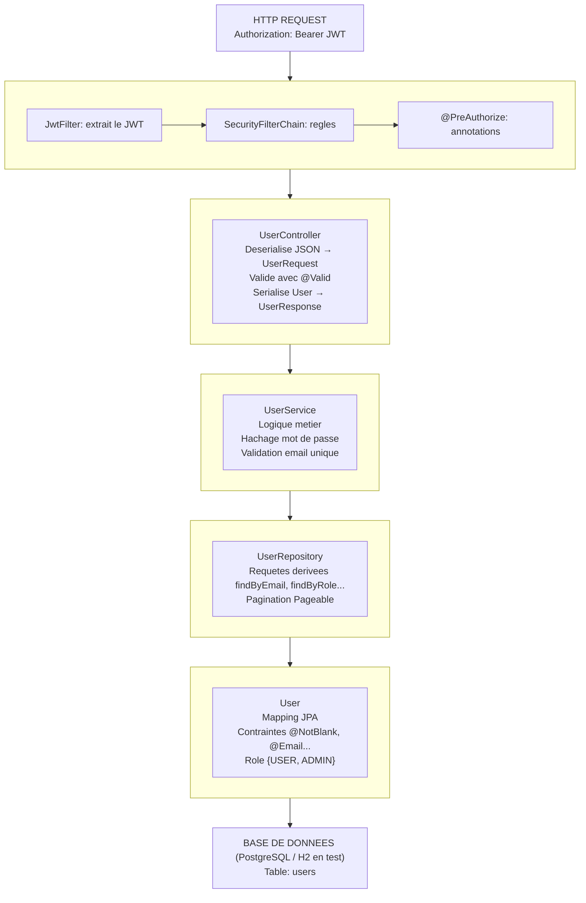
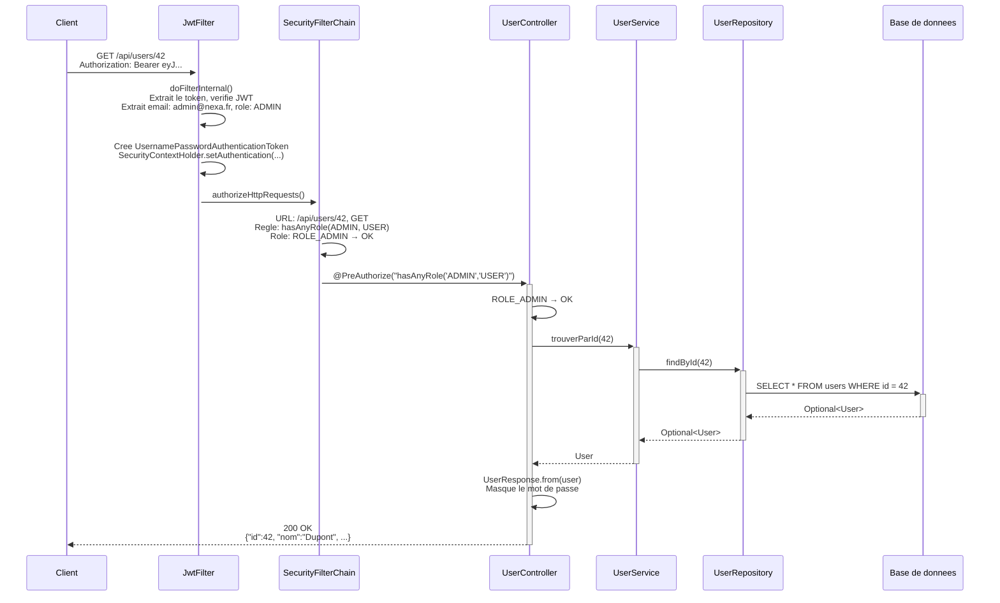
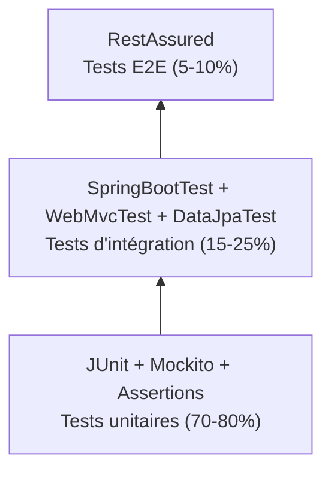

# Module 8 — Projet Final : Application de Gestion d'Utilisateurs

**Durée : 1h45 (15h15–17h00) — Jour 2 Après-midi**

**Module le plus important : synthese de TOUTE la formation**

**Prérequis :** Modules 1 à 7 (JUnit, tests paramétrés, Mockito, TDD, OWASP, Spring Boot Tests, Spring Security)

**Labs associés :** `labs/lab08-user-manager/`

---

## Objectifs pédagogiques

À l'issue de ce module, vous serez capable de :

1. Comprendre l'architecture complète d'une application Spring Boot sécurisée
2. Maîtriser le flux Controller → Service → Repository → Entity
3. Implémenter une API REST complète avec pagination, validation et recherche
4. Configurer Spring Security avec JWT à tous les niveaux
5. Gérer les exceptions avec `@RestControllerAdvice` (format RFC 7807)
6. Écrire une suite de tests complète couvrant toutes les couches
7. Utiliser JaCoCo pour mesurer la couverture de code
8. Configurer une pipeline CI/CD avec contrôle de qualité

---

## Métaphore du jour

> **Construire une maison de A à Z**
>
> La **fondation** (Entity, Repository) soutient les **murs** (Service, logique métier)
> et le **toit** (Controller, API). La **serrure** (Security, JWT) protège l'entrée.
> La **plomberie cachée** (ExceptionHandler) gère les fuites.
> L'**inspecteur** (Tests) vérifie chaque pièce avant d'emménager.

---

## PARTIE 1 -- THEORIE (30 min)

## 1. Architecture de l'application

### Diagramme des couches



 HTTP REQUEST
 Authorization: Bearer <JWT>

 COUCHE SÉCURITÉ

 JwtFilter SecurityFilter @PreAuthorize
 (extrait Chain (règles) (annotations)
 le JWT)

 COUCHE CONTRÔLEUR (@RestController)

 UserController
 - Désérialise le JSON → UserRequest (DTO)
 - Valide avec @Valid
 - Appelle le Service
 - Sérialise User → UserResponse (DTO)

 COUCHE SERVICE (@Service, @Transactional)

 UserService
 - Logique métier
 - Hachage mot de passe
 - Validation métier (email unique)
 - Gestion des transactions

 COUCHE REPOSITORY (@Repository, JpaRepository)

 UserRepository
 - Requêtes dérivées (findByEmail, findByRole...)
 - Pagination (Pageable)
 - Comptage (countByRole)

 COUCHE ENTITÉ (@Entity, @Table)

 User
 - Mapping JPA (id, nom, prenom, email, password...)
 - Contraintes (@Column, @NotBlank, @Email...)
 - Énumération Role {USER, ADMIN}

 BASE DE DONNÉES (PostgreSQL / H2 en test)
 Table: users
 Colonnes: id, nom, prenom, email, password, role, actif,
 date_creation, date_modification

```

### Flux d'une requête complète

Prenons l'exemple d'une requête `GET /api/users/42` avec un token ADMIN :



> **Remarque :** Le mot de passe n'est **jamais** dans la réponse.
> C'est le DTO `UserResponse` qui filtre les champs sensibles.

---

## 2. Rappel de TOUTES les annotations vues pendant la formation

### Tableau géant des annotations — 2 jours de formation

#### JUnit 5 (Modules 1–2)

| Annotation | Package | Rôle | Module |
|---|---|---|---|
| `@Test` | `org.junit.jupiter.api` | Marque une méthode de test | M01 |
| `@ParameterizedTest` | `org.junit.jupiter.params` | Test paramétré avec source de données | M02 |
| `@DisplayName("...")` | `org.junit.jupiter.api` | Nom lisible du test | M01 |
| `@Nested` | `org.junit.jupiter.api` | Regroupe des tests imbriqués | M01 |
| `@Tag("integration")` | `org.junit.jupiter.api` | Catégorise les tests | M01 |
| `@Timeout(5)` | `org.junit.jupiter.api` | Timeout en secondes | M02 |
| `@BeforeEach` | `org.junit.jupiter.api` | Exécuté avant chaque test | M01 |
| `@AfterEach` | `org.junit.jupiter.api` | Exécuté après chaque test | M01 |
| `@BeforeAll` | `org.junit.jupiter.api` | Exécuté une fois avant tous les tests (static) | M01 |
| `@AfterAll` | `org.junit.jupiter.api` | Exécuté une fois après tous les tests (static) | M01 |
| `@ValueSource(ints = {...})` | `org.junit.jupiter.params.provider` | Source de valeurs simples | M02 |
| `@CsvSource({...})` | `org.junit.jupiter.params.provider` | Source de valeurs CSV | M02 |
| `@MethodSource("...")` | `org.junit.jupiter.params.provider` | Source depuis une méthode | M02 |
| `@CsvFileSource(...)` | `org.junit.jupiter.params.provider` | Source depuis un fichier CSV | M02 |
| `@EnumSource(...)` | `org.junit.jupiter.params.provider` | Source depuis une énumération | M02 |
| `@NullSource` / `@EmptySource` | `org.junit.jupiter.params.provider` | Injecte null / vide | M02 |
| `@NullAndEmptySource` | `org.junit.jupiter.params.provider` | Injecte null ET vide | M02 |

#### Mockito (Module 3)

| Annotation | Rôle | Module |
|---|---|---|
| `@Mock` | Crée un mock de l'objet | M03 |
| `@InjectMocks` | Injecte les mocks dans l'objet testé | M03 |
| `@Spy` | Espionne un objet réel | M03 |
| `@Captor` | Capture les arguments passés aux mocks | M03 |
| `@ExtendWith(MockitoExtension.class)` | Active les annotations Mockito | M03 |

#### Assertions JUnit 5 (Module 1)

| Méthode | Usage |
|---|---|
| `assertEquals(expected, actual)` | Égalité |
| `assertNotEquals(unexpected, actual)` | Non-égalité |
| `assertTrue(condition)` | Condition vraie |
| `assertFalse(condition)` | Condition fausse |
| `assertNull(object)` | Objet null |
| `assertNotNull(object)` | Objet non null |
| `assertThrows(Ex.class, () -> ...)` | Vérifie qu'une exception est levée |
| `assertDoesNotThrow(() -> ...)` | Vérifie qu'aucune exception n'est levée |
| `assertAll(...)` | Groupe des assertions (toutes exécutées) |

#### Mockito — Vérifications (Module 3)

| Méthode | Usage |
|---|---|
| `when(mock.method()).thenReturn(value)` | Stubbing : définit le comportement |
| `when(mock.method()).thenThrow(ex)` | Stubbing : lève une exception |
| `verify(mock).method()` | Vérifie que la méthode a été appelée |
| `verify(mock, times(n)).method()` | Vérifie le nombre d'appels |
| `verify(mock, never()).method()` | Vérifie que la méthode n'a JAMAIS été appelée |
| `verifyNoInteractions(mock)` | Vérifie aucune interaction avec le mock |
| `verifyNoMoreInteractions(mock)` | Vérifie plus aucune interaction |
| `any(Class.class)` | Matcher : n'importe quelle instance |
| `eq(value)` | Matcher : égalité exacte |
| `argThat(predicate)` | Matcher personnalisé |

#### Spring Boot — Général (Module 6)

| Annotation | Rôle | Module |
|---|---|---|
| `@SpringBootApplication` | Point d'entrée (combo @Configuration + @EnableAutoConfiguration + @ComponentScan) | M06 |
| `@RestController` | Contrôleur REST (@Controller + @ResponseBody) | M06 |
| `@Service` | Service métier (stéréotype Spring) | M06 |
| `@Repository` | Repository (stéréotype + traduction exceptions) | M06 |
| `@Autowired` | Injection de dépendances (sur constructeur recommandé) | M06 |
| `@Component` | Bean Spring générique | M07 |
| `@Configuration` | Classe de configuration | M07 |
| `@Bean` | Déclare un bean | M07 |
| `@Value("${prop}")` | Injection de propriété | M06 |
| `@Qualifier("nom")` | Précise le bean à injecter | M06 |
| `@Primary` | Bean prioritaire en cas d'ambiguïté | M06 |
| `@Transactional` | Gestion des transactions | M06 |
| `@CommandLineRunner` | Code exécuté au démarrage | M07 |

#### Spring Test (Module 6)

| Annotation | Rôle | Module |
|---|---|---|
| `@SpringBootTest` | Démarre le contexte Spring complet | M06 |
| `@WebMvcTest` | Teste uniquement la couche MVC | M06 |
| `@DataJpaTest` | Teste uniquement la couche JPA | M06 |
| `@AutoConfigureMockMvc` | Configure MockMvc | M07 |
| `@MockBean` | Mock Spring (remplace le bean dans le contexte) | M06 |
| `@Import(Config.class)` | Importe une configuration spécifique | M08 |

#### Spring Security (Module 7)

| Annotation | Rôle | Module |
|---|---|---|
| `@EnableWebSecurity` | Active Spring Security | M07 |
| `@EnableMethodSecurity` | Active @PreAuthorize / @PostAuthorize | M07 |
| `@PreAuthorize("hasRole('ADMIN')")` | Vérifie avant exécution de la méthode | M07 |
| `@PostAuthorize("...")` | Vérifie après exécution de la méthode | M07 |
| `@WithMockUser(roles = "ADMIN")` | Simule un utilisateur pour les tests | M07 |
| `@WithAnonymousUser` | Simule un utilisateur non connecté | M08 |

#### JPA (Module 6)

| Annotation | Rôle | Module |
|---|---|---|
| `@Entity` | Marque une classe comme entité JPA | M06 |
| `@Table(name = "users")` | Nom de la table en base | M06 |
| `@Id` | Clé primaire | M06 |
| `@GeneratedValue(strategy = GenerationType.IDENTITY)` | Auto-incrément | M06 |
| `@Column(unique = true, nullable = false)` | Contrainte de colonne | M06 |
| `@Enumerated(EnumType.STRING)` | Stocke l'enum en String | M08 |
| `@CreatedDate` | Date de création automatique | — |
| `@LastModifiedDate` | Date de modification automatique | — |

#### Bean Validation (Module 8)

| Annotation | Rôle |
|---|---|
| `@NotBlank` | Non null et non vide (ignore les espaces) |
| `@NotNull` | Non null |
| `@NotEmpty` | Non null et non vide (collections, strings) |
| `@Size(min=2, max=50)` | Taille min/max |
| `@Email` | Format email valide |
| `@Positive` / `@PositiveOrZero` | Valeur > 0 / >= 0 |
| `@Min(value)` / `@Max(value)` | Valeur minimale / maximale |
| `@Pattern(regexp="...")` | Expression régulière |
| `@Valid` | Valide l'objet imbriqué |

#### REST (Module 6)

| Annotation | Rôle | Module |
|---|---|---|
| `@GetMapping("/path")` | Requête GET | M06 |
| `@PostMapping("/path")` | Requête POST | M06 |
| `@PutMapping("/path")` | Requête PUT | M06 |
| `@DeleteMapping("/path")` | Requête DELETE | M06 |
| `@PathVariable Long id` | Extrait une variable du chemin | M06 |
| `@RequestBody` | Désérialise le corps de la requête | M06 |
| `@RequestParam String nom` | Extrait un paramètre de requête | M06 |
| `@Valid` | Déclenche la validation Bean Validation | M08 |
| `@ResponseStatus(HttpStatus.CREATED)` | Définit le code de statut HTTP | M08 |

#### Gestion d'erreurs (Module 8)

| Annotation | Rôle |
|---|---|
| `@RestControllerAdvice` | Gestionnaire global d'exceptions |
| `@ExceptionHandler(Ex.class)` | Définit le traitement d'une exception |

---

## 3. Gestion des exceptions avec @RestControllerAdvice (RFC 7807)

### Le problème

Sans gestionnaire d'exceptions, une erreur non gérée produit une réponse peu informative :

```json
{
 "timestamp": "2024-01-01T10:00:00",
 "status": 500,
 "error": "Internal Server Error",
 "path": "/api/users/999"
}
```

Ce format par défaut ne respecte aucun standard et ne donne pas assez de détails
pour le client (ex: application front-end React).

### La solution : RFC 7807 — Problem Details

La RFC 7807 définit un format standard pour les réponses d'erreur HTTP :

```json
{
 "status": 404,
 "title": "Ressource non trouvée",
 "detail": "Utilisateur introuvable : id=42",
 "errors": null
}
```

| Champ | Description |
|---|---|
| `status` | Code HTTP numérique |
| `title` | Titre court décrivant le problème |
| `detail` | Description détaillée pour les développeurs |
| `errors` | Map des erreurs par champ (validation) |

### Le mécanisme `@RestControllerAdvice`

```java
@RestControllerAdvice // Intercepte TOUTES les exceptions de TOUS les @RestController
public class GlobalExceptionHandler {

	@ExceptionHandler(ResourceNotFoundException.class)
	// Gère l'exception quand une ressource (utilisateur) n'est pas trouvée en base
	public ResponseEntity<ErrorResponse> handleNotFound(ResourceNotFoundException e) {
	 return ResponseEntity.status(HttpStatus.NOT_FOUND) // Retourne HTTP 404
	  .body(new ErrorResponse(404, "Ressource non trouvée", e.getMessage())); // Corps au format RFC 7807
	}

	@ExceptionHandler(BusinessException.class)
	// Gère les conflits métier (ex: email déjà utilisé, token expiré)
	public ResponseEntity<ErrorResponse> handleBusiness(BusinessException e) {
	 return ResponseEntity.status(HttpStatus.CONFLICT) // Retourne HTTP 409
	  .body(new ErrorResponse(409, "Conflit métier", e.getMessage()));
	}

	@ExceptionHandler(MethodArgumentNotValidException.class)
	// Gère les erreurs de validation @Valid sur les DTO (champs invalides)
	public ResponseEntity<ErrorResponse> handleValidation(MethodArgumentNotValidException e) {
	 Map<String, String> errors = new HashMap<>(); // Map pour stocker erreur par champ
	 for (FieldError fe : e.getBindingResult().getFieldErrors()) {
	  // Parcourt chaque champ invalide et associe le message d'erreur
	  errors.put(fe.getField(), fe.getDefaultMessage());
	 }
	 return ResponseEntity.status(HttpStatus.BAD_REQUEST) // Retourne HTTP 400
	  .body(new ErrorResponse(400, "Erreur de validation",
	   "Un ou plusieurs champs sont invalides", errors)); // Inclut les détails par champ
	}

	@ExceptionHandler(IllegalArgumentException.class)
	// Gère les arguments invalides passés aux méthodes
	public ResponseEntity<ErrorResponse> handleIllegalArgument(IllegalArgumentException e) {
	 return ResponseEntity.status(HttpStatus.BAD_REQUEST) // Retourne HTTP 400
	  .body(new ErrorResponse(400, "Argument invalide", e.getMessage()));
	}
}
```

**Exceptions personnalisées :**

```java
// Exception pour les ressources non trouvées
public class ResourceNotFoundException extends RuntimeException {
	// Constructeur : stocke le message d'erreur détaillée
	public ResourceNotFoundException(String message) { super(message); }
}

// Exception pour les conflits métier
public class BusinessException extends RuntimeException {
	// Constructeur : stocke le message d'erreur détaillée
	public BusinessException(String message) { super(message); }
}
```

---

## PARTIE 2 -- PRATIQUE PAS A PAS (50 min)

### Structure du projet

```
lab08-user-manager/
  pom.xml
  src/
    main/
      java/com/nexa/usermanager/
        UserManagerApplication.java
        config/
          SecurityConfig.java
          AppConfig.java
        entity/
          User.java
        dto/
          UserRequest.java
          UserResponse.java
          ErrorResponse.java
        repository/
          UserRepository.java
        service/
          UserService.java
        controller/
          UserController.java
        security/
          JwtUtil.java
          JwtFilter.java
        exception/
          ResourceNotFoundException.java
          BusinessException.java
          GlobalExceptionHandler.java
      resources/
        application.properties
    test/
      java/com/nexa/usermanager/
        unit/
          UserEntityTest.java
          UserRequestTest.java
          UserResponseTest.java
          UserServiceTest.java
          ErrorResponseTest.java
          ExceptionsTest.java
          GlobalExceptionHandlerTest.java
        controller/
          UserControllerTest.java
        repository/
          UserRepositoryTest.java
        security/
          JwtUtilTest.java
          SecurityTests.java
        resources/
          application.properties
          application-test.properties
```

---

### pom.xml — Dépendances du projet final

 `labs/lab08-user-manager/pom.xml`

Ce pom.xml est le plus complet de la formation. Il déclare les versions des 5 outils de qualité (JaCoCo, Failsafe, PIT, OWASP Check) en plus des starters Spring Boot. Les propriétés centralisent les numéros de version pour faciliter les mises à jour.

```xml
<parent>
 <groupId>org.springframework.boot</groupId>
 <artifactId>spring-boot-starter-parent</artifactId>
 <version>3.2.5</version>
</parent>

<groupId>com.nexa</groupId>
<artifactId>user-manager</artifactId>
<version>1.0.0</version>

<properties>
 <java.version>17</java.version>
 <jjwt.version>0.12.5</jjwt.version>
 <testcontainers.version>1.19.7</testcontainers.version>
 <pitest.version>1.15.8</pitest.version>
 <rest-assured.version>5.4.0</rest-assured.version>
 <owasp-check.version>9.0.7</owasp-check.version>
</properties>
```

### Dépendances principales

Cinq starters Spring Boot forment le socle : Web (REST + Tomcat), Security (JWT), Data JPA (persistance), Validation (Bean Validation), et Actuator (health checks). C'est la combinaison standard pour une API REST professionnelle.

```xml
<dependencies>
 <!-- Web, Security, JPA, Validation, Actuator : le socle Spring Boot -->
 <dependency>
 <groupId>org.springframework.boot</groupId>
 <artifactId>spring-boot-starter-web</artifactId>
 </dependency>
 <dependency>
 <groupId>org.springframework.boot</groupId>
 <artifactId>spring-boot-starter-security</artifactId>
 </dependency>
 <dependency>
 <groupId>org.springframework.boot</groupId>
 <artifactId>spring-boot-starter-data-jpa</artifactId>
 </dependency>
 <dependency>
 <groupId>org.springframework.boot</groupId>
 <artifactId>spring-boot-starter-validation</artifactId>
 </dependency>
 <dependency>
 <groupId>org.springframework.boot</groupId>
 <artifactId>spring-boot-starter-actuator</artifactId>
 </dependency>
```

### Base de données

Deux bases cohabitent : PostgreSQL en production (scope runtime) et H2 en mémoire pour les tests (scope test). Ce pattern est le standard industriel pour les applications Spring Boot.

```xml
 <!-- PostgreSQL en production -->
 <dependency>
 <groupId>org.postgresql</groupId>
 <artifactId>postgresql</artifactId>
 <scope>runtime</scope>
 </dependency>

 <!-- H2 en test -->
 <dependency>
 <groupId>com.h2database</groupId>
 <artifactId>h2</artifactId>
 <scope>test</scope>
 </dependency>
```

**Pourquoi deux bases ?**
- **PostgreSQL** en production : robuste, supporte la concurrence
- **H2 en mémoire** pour les tests : rapide, pas d'installation, isolé
- Ce pattern est standard : "tester avec H2, déployer avec PostgreSQL"

### JWT

JJWT 0.12.5 est intégré avec le même découpage en trois artefacts : jjwt-api (interfaces), jjwt-impl (implémentation), jjwt-jackson (sérialisation JSON).

```xml
 <dependency>
 <groupId>io.jsonwebtoken</groupId>
 <artifactId>jjwt-api</artifactId>
 <version>${jjwt.version}</version>
 </dependency>
 <dependency>
 <groupId>io.jsonwebtoken</groupId>
 <artifactId>jjwt-impl</artifactId>
 <version>${jjwt.version}</version>
 <scope>runtime</scope>
 </dependency>
 <dependency>
 <groupId>io.jsonwebtoken</groupId>
 <artifactId>jjwt-jackson</artifactId>
 <version>${jjwt.version}</version>
 <scope>runtime</scope>
 </dependency>
```

### Tests

Les deux dépendances de test sont spring-boot-starter-test (JUnit 5, Mockito, MockMvc) et spring-security-test (@WithMockUser, @WithAnonymousUser). Ensemble, elles couvrent tous les types de tests de la pyramide.

```xml
 <dependency>
  <groupId>org.springframework.boot</groupId>
 <artifactId>spring-boot-starter-test</artifactId>
 <scope>test</scope>
 </dependency>
 <dependency>
 <groupId>org.springframework.security</groupId>
 <artifactId>spring-security-test</artifactId>
 <scope>test</scope>
 </dependency>
```

### Plugins de build

#### JaCoCo — Couverture de code

JaCoCo est configuré en trois phases : prepare-agent instrumente le bytecode, report génère un rapport HTML, et check fait échouer le build si les seuils de couverture (lignes >80%, branches >70%) ne sont pas atteints.

```xml
<plugin>
 <groupId>org.jacoco</groupId>
 <artifactId>jacoco-maven-plugin</artifactId>
 <version>0.8.11</version>
 <executions>
 <execution>
 <id>prepare-agent</id>
 <goals><goal>prepare-agent</goal></goals>
 </execution>
 <execution>
 <id>report</id>
 <phase>test</phase>
 <goals><goal>report</goal></goals>
 </execution>
 <execution>
 <id>check</id>
 <phase>test</phase>
 <goals><goal>check</goal></goals>
 <configuration>
 <rules>
 <rule>
 <element>BUNDLE</element>
 <limits>
 <limit>
 <counter>LINE</counter>
 <value>COVEREDRATIO</value>
 <minimum>0.80</minimum> <!-- 80% lignes -->
 </limit>
 <limit>
 <counter>BRANCH</counter>
 <value>COVEREDRATIO</value>
 <minimum>0.70</minimum> <!-- 70% branches -->
 </limit>
 </limits>
 </rule>
 </rules>
 </configuration>
 </execution>
 </executions>
</plugin>
```

**JaCoCo (Java Code Coverage)** mesure le pourcentage de code couvert par les tests.
Deux métriques sont vérifiées :
- **LINE** (couverture de lignes) : minimum 80%
- **BRANCH** (couverture de branches conditionnelles) : minimum 70%

Si la couverture est insuffisante, le build **échoue** (`mvn test` → BUILD FAILURE).

#### maven-failsafe-plugin — Tests d'intégration

```xml
<plugin>
 <groupId>org.apache.maven.plugins</groupId>
 <artifactId>maven-failsafe-plugin</artifactId>
 <version>3.2.5</version>
 <executions>
 <execution>
 <goals>
 <goal>integration-test</goal>
 <goal>verify</goal>
 </goals>
 </execution>
 </executions>
</plugin>
```

#### PIT Mutation Testing — Tests de mutation

PIT modifie le code source (ex: > devient >=, && devient ||) et vérifie que les tests détectent ces mutations. Si une mutation survit (les tests restent verts), cela révèle un test insuffisant. La configuration cible le package service avec le mutateur STRONGER.

```xml
<plugin>
  <groupId>org.pitest</groupId>
  <artifactId>pitest-maven</artifactId>
 <version>${pitest.version}</version>
 <configuration>
 <targetClasses>
 <param>com.nexa.usermanager.service.*</param>
 </targetClasses>
 <targetTests>
 <param>com.nexa.usermanager.unit.*</param>
 </targetTests>
 <mutators>
 <mutator>STRONGER</mutator>
 </mutators>
 </configuration>
</plugin>
```

**PIT Mutation Testing** modifie le code source (mutations) et vérifie que les tests détectent
les changements. Si une mutation passe inaperçue, les tests ne sont pas assez solides.

#### OWASP Dependency Check

```xml
<plugin>
 <groupId>org.owasp</groupId>
 <artifactId>dependency-check-maven</artifactId>
 <version>${owasp-check.version}</version>
 <executions>
 <execution>
 <goals><goal>check</goal></goals>
 </execution>
 </executions>
</plugin>
```

**OWASP Dependency Check** scanne les dépendances Maven et vérifie qu'aucune vulnérabilité
connue (CVE) n'est présente.

---

### UserManagerApplication.java — Point d'entrée

 `labs/lab08-user-manager/src/main/java/com/nexa/usermanager/UserManagerApplication.java`

```java
@SpringBootApplication // Méta-annotation : @Configuration + @EnableAutoConfiguration + @ComponentScan
public class UserManagerApplication {
	// Point d'entrée de l'application Spring Boot
	public static void main(String[] args) {
	 SpringApplication.run(UserManagerApplication.class, args); // Démarre le contexte Spring
	}
}
```

`@SpringBootApplication` est une méta-annotation qui combine :
- `@Configuration` : la classe peut déclarer des `@Bean`
- `@EnableAutoConfiguration` : configure automatiquement Spring Boot
- `@ComponentScan` : scanne les composants du package `com.nexa.usermanager`

---

### User.java — L'entité JPA

 `labs/lab08-user-manager/src/main/java/com/nexa/usermanager/entity/User.java`

```java
@Entity // Marque cette classe comme entité JPA mappée à une table
@Table(name = "users") // Nom de la table en base de données
public class User {

	@Id // Clé primaire de la table
	@GeneratedValue(strategy = GenerationType.IDENTITY) // Auto-incrément géré par la base
	private Long id;

	@NotBlank // Validation : ne doit être ni null ni vide (ignorant les espaces)
	@Size(min = 2, max = 50) // Longueur minimale 2, maximale 50 caractères
	@Column(nullable = false, length = 50) // Colonne NOT NULL en base, taille max 50
	private String nom;

	@NotBlank
	@Size(min = 2, max = 50)
	@Column(nullable = false, length = 50)
	private String prenom;

	@NotBlank
	@Email // Validation : doit respecter le format d'un email
	@Column(unique = true, nullable = false) // Contrainte d'unicité en base (pas de doublon)
	private String email;

	@NotBlank
	@Size(min = 8) // Mot de passe d'au moins 8 caractères
	@Column(nullable = false)
	private String password; // Stocke le hash BCrypt, jamais le mot de passe en clair

	@NotNull
	@Column(nullable = false)
	@Enumerated(EnumType.STRING) // Stocke le nom de l'enum en texte ("USER" / "ADMIN"), pas en nombre
	private Role role = Role.USER; // Valeur par défaut : USER

	@Column(nullable = false)
	private boolean actif = true; // Compte actif par défaut (désactivable sans supprimer)

	@Column(nullable = false)
	private LocalDateTime dateCreation = LocalDateTime.now(); // Date de création auto-initialisée

	private LocalDateTime dateModification; // Null tant qu'aucune modification n'a eu lieu

	public enum Role { USER, ADMIN } // Énumération des rôles : USER (lecture) et ADMIN (écriture)
	// ... constructeurs, getters, setters
}
```

### Analyse détaillée de chaque champ

| Champ | Type | Annotations | Rôle |
|---|---|---|---|
| `id` | `Long` | `@Id`, `@GeneratedValue(IDENTITY)` | Clé primaire auto-incrémentée |
| `nom` | `String` | `@NotBlank`, `@Size(2,50)`, `@Column` | Nom de famille |
| `prenom` | `String` | `@NotBlank`, `@Size(2,50)`, `@Column` | Prénom |
| `email` | `String` | `@NotBlank`, `@Email`, `@Column(unique)` | Email unique (sert d'identifiant de connexion) |
| `password` | `String` | `@NotBlank`, `@Size(min=8)`, `@Column` | Mot de passe hashé (BCrypt) |
| `role` | `Role` | `@NotNull`, `@Enumerated(STRING)`, défaut `USER` | Rôle (USER ou ADMIN) |
| `actif` | `boolean` | `@Column`, défaut `true` | Compte actif/désactivé |
| `dateCreation` | `LocalDateTime` | `@Column`, défaut `now()` | Date de création |
| `dateModification` | `LocalDateTime` | `@Column` | Date de dernière modification |

### Pourquoi `@Enumerated(EnumType.STRING)` ?

Deux stratégies pour stocker une énumération en base :

| Stratégie | En base | Avantage | Inconvénient |
|---|---|---|---|
| `EnumType.ORDINAL` | `0`, `1`, `2`... | Compact | Fragile : ajouter une valeur décale l'ordre |
| `EnumType.STRING` | `"USER"`, `"ADMIN"` | **Lisible, robuste** | Légèrement plus volumineux |

**Toujours utiliser `STRING`** : le code est auto-documenté et insensible aux réorganisations.

### Différence entre `@NotBlank` et `@NotNull`

| Annotation | Null | "" (vide) | " " (espaces) | "abc" |
|---|---|---|---|---|
| `@NotNull` | | | | |
| `@NotEmpty` | | | | |
| `@NotBlank` | | | | |

`@NotBlank` est la plus restrictive et la plus adaptée aux champs texte obligatoires.

### Constructeurs

```java
public User() {} // Constructeur vide obligatoire pour JPA (utilisé lors de la désérialisation depuis la base)

public User(String nom, String prenom, String email, String password, Role role) {
	// Constructeur paramétré pour créer un utilisateur avec toutes les infos essentielles
	this.nom = nom;
	this.prenom = prenom;
	this.email = email;
	this.password = password;
	this.role = role;
}
```

**Pourquoi un constructeur vide ?** JPA en a besoin pour instancier les entités
lors de la désérialisation depuis la base de données.

---

### UserRequest.java — DTO d'entrée

 `labs/lab08-user-manager/src/main/java/com/nexa/usermanager/dto/UserRequest.java`

```java
public class UserRequest {
	// DTO d'entrée : reçoit les données JSON du client pour création/mise à jour

	@NotBlank(message = "Le nom est obligatoire") // Validation : champ requis + message personnalisé en français
	@Size(min = 2, max = 50, message = "Le nom doit contenir entre 2 et 50 caractères")
	private String nom;

	@NotBlank(message = "Le prénom est obligatoire")
	@Size(min = 2, max = 50, message = "Le prénom doit contenir entre 2 et 50 caractères")
	private String prenom;

	@NotBlank(message = "L'email est obligatoire")
	@Email(message = "Format d'email invalide") // Vérifie la syntaxe de l'email
	private String email;

	@NotBlank(message = "Le mot de passe est obligatoire")
	@Size(min = 8, message = "Le mot de passe doit contenir au moins 8 caractères")
	private String password; // Mot de passe en clair reçu du client (sera hashé par le service)

	@NotNull(message = "Le rôle est obligatoire")
	private String role; // Reçu en String, converti en User.Role par le contrôleur
	// ... getters, setters
}
```

### Pourquoi un DTO d'entrée ?

**Séparation des préoccupations :**
- Le JSON reçu du client est **désérialisé** en `UserRequest`
- Les messages de validation sont **personnalisés** en français
- Le contrôleur convertit `UserRequest` → `User` (entité)
- L'entité ne dépend pas du format JSON

**Messages de validation personnalisés :**
```java
@NotBlank(message = "Le nom est obligatoire")
```
Si le champ est vide, le message d'erreur sera en français et explicite.

---

### UserResponse.java — DTO de sortie

 `labs/lab08-user-manager/src/main/java/com/nexa/usermanager/dto/UserResponse.java`

```java
public class UserResponse {
	// DTO de sortie : filtre les données renvoyées au client (surtout, PAS de password)

	private Long id;
	private String nom;
	private String prenom;
	private String email;
	private String role; // Converti en String pour le JSON
	private boolean actif;
	private LocalDateTime dateCreation;
	private LocalDateTime dateModification;

	// Méthode factory : convertit une entité User en DTO de réponse
	public static UserResponse from(User user) {
	 UserResponse r = new UserResponse();
	 r.id = user.getId();
	 r.nom = user.getNom();
	 r.prenom = user.getPrenom();
	 r.email = user.getEmail();
	 r.role = user.getRole().name(); // Role.ADMIN → "ADMIN" pour le JSON
	 r.actif = user.isActif();
	 r.dateCreation = user.getDateCreation();
	 r.dateModification = user.getDateModification();
	 return r;
	}
	// ... getters, setters
}
```

### Points clés

1. **Pas de champ `password`** : le mot de passe n'est **jamais** exposé dans l'API
2. **Factory method `from(User)`** : méthode statique pour convertir une entité en DTO
3. **`role` en String** : le rôle est converti de `Role.ADMIN` vers `"ADMIN"` pour le JSON
4. **`dateModification` peut être null** : pas de `@Column(nullable = false)` sur ce champ

### Pourquoi un DTO de sortie ?

Si on renvoyait directement l'entité `User`, le JSON contiendrait :
```json
{
 "password": "$2a$10$N9qo8uLOickgx2ZMRZoMye...", // ← CATASTROPHE
 "role": "USER" // ou pire si String : exposé tel quel
}
```

Le DTO **filtre** les champs sensibles et **structure** la réponse selon le contrat d'API.

---

### UserRepository.java — Accès aux données

 `labs/lab08-user-manager/src/main/java/com/nexa/usermanager/repository/UserRepository.java`

```java
@Repository // Stéréotype Spring : bean d'accès aux données + traduction des exceptions JPA
public interface UserRepository extends JpaRepository<User, Long> {
	// JpaRepository fournit déjà : findAll, findById, save, deleteById, etc.

	Optional<User> findByEmail(String email); // Requête : WHERE email = ? — retourne Optional pour forcer la gestion du cas "non trouvé"
	boolean existsByEmail(String email); // Requête : SELECT COUNT(*) > 0 WHERE email = ? — utile avant création pour vérifier l'unicité
	List<User> findByNomContainingIgnoreCase(String nom); // Requête : WHERE LOWER(nom) LIKE LOWER(CONCAT('%', ?, '%')) — recherche insensible à la casse
	List<User> findByActif(boolean actif); // Filtre les utilisateurs par statut actif/inactif
	Page<User> findByRole(User.Role role, Pageable pageable); // Requête avec pagination : LIMIT + OFFSET générés automatiquement
	long countByRole(User.Role role); // Compte le nombre d'utilisateurs d'un rôle donné
}
```

### Analyse de chaque méthode dérivée

| Méthode | Requête JPQL générée | Cas d'usage |
|---|---|---|
| `findByEmail` | `WHERE u.email = ?1` | Authentification, recherche par email |
| `existsByEmail` | `SELECT COUNT(u) > 0 WHERE u.email = ?1` | Vérifier l'unicité avant création |
| `findByNomContainingIgnoreCase` | `WHERE LOWER(u.nom) LIKE LOWER(CONCAT('%', ?1, '%'))` | Recherche "comme Google" |
| `findByActif` | `WHERE u.actif = ?1` | Filtrer les utilisateurs actifs/inactifs |
| `findByRole` | `WHERE u.role = ?1` (avec pagination) | Lister les utilisateurs par rôle |
| `countByRole` | `SELECT COUNT(u) WHERE u.role = ?1` | Statistiques |

### Pourquoi `Optional<User>` pour `findByEmail` ?

`Optional` force le code appelant à gérer le cas "utilisateur non trouvé".
C'est plus explicite que retourner `null`.

### Pagination avec `Pageable`

Le paramètre `Pageable` dans `findByRole` permet :
```
GET /api/users/page?page=0&size=10&sort=nom,asc
```

Spring Data génère automatiquement `LIMIT 10 OFFSET 0 ORDER BY nom ASC`.

---

### UserService.java — Logique métier

 `labs/lab08-user-manager/src/main/java/com/nexa/usermanager/service/UserService.java`

```java
@Service // Stéréotype Spring : bean de la couche métier
@Transactional // Toutes les méthodes publiques sont transactionnelles (rollback automatique en cas d'erreur)
public class UserService {

	// Dépendances injectées par constructeur (pas besoin de @Autowired avec un seul constructeur)
	private final UserRepository repo; // Accès aux données
	private final PasswordEncoder encoder; // Hachage BCrypt des mots de passe

	public UserService(UserRepository repo, PasswordEncoder encoder) {
	 this.repo = repo;
	 this.encoder = encoder;
	}
```

**`@Transactional`** sur la classe : toutes les méthodes publiques sont transactionnelles.
Si une exception non catchée est levée, la transaction est rollbackée (annulée).

**Injection par constructeur** : la meilleure pratique. Pas de `@Autowired` nécessaire
quand il n'y a qu'un seul constructeur.

### Méthode `creer()`

```java
	public User creer(User user) {
	 // Vérifie d'abord si l'email est déjà pris (contrainte métier, en plus de la contrainte base)
	 if (repo.existsByEmail(user.getEmail())) {
	  throw new RuntimeException("Email déjà utilisé"); // Exception simple, sera catchée par GlobalExceptionHandler
	 }
	 user.setPassword(encoder.encode(user.getPassword())); // Hash le mot de passe avec BCrypt avant sauvegarde
	 return repo.save(user); // Sauvegarde en base et retourne l'entité avec son ID généré
	}
```

**Logique métier :**
1. Vérifie que l'email n'est pas déjà pris
2. Hash le mot de passe avec BCrypt (règle d'or : jamais en clair)
3. Sauvegarde en base

### Méthode `listerTous()` et `listerPagine()`

```java
	public List<User> listerTous() {
	 // Retourne tous les utilisateurs sans pagination (peut être lourd, réservé aux petits jeux de données)
	 return repo.findAll();
	}

	public Page<User> listerPagine(Pageable pageable) {
	 // Retourne une page d'utilisateurs avec pagination (recommandé pour la production)
	 return repo.findAll(pageable); // Spring Data applique automatiquement LIMIT / OFFSET
	}
```

Deux modes de lecture :
- **Sans pagination** : `listerTous()` → tous les utilisateurs ( peut être lourd)
- **Avec pagination** : `listerPagine()` → page par page (recommandé pour la production)

### Méthode `trouverParId()`

```java
	public User trouverParId(Long id) {
	 // Cherche l'utilisateur par son ID ; s'il n'existe pas, lève une exception personnalisée (→ 404)
	 return repo.findById(id)
	  .orElseThrow(() -> new ResourceNotFoundException(
	   "Utilisateur introuvable : id=" + id));
	}
```

**Lève une exception personnalisée** au lieu de retourner null.
Cela permet au `GlobalExceptionHandler` de générer une réponse 404 propre.

### Méthode `mettreAJour()`

```java
	public User mettreAJour(Long id, User update) {
	 User existant = trouverParId(id); // Charge l'entité existante (lève 404 si introuvable)
	 existant.setNom(update.getNom()); // Met à jour le nom
	 existant.setPrenom(update.getPrenom()); // Met à jour le prénom
	 existant.setEmail(update.getEmail()); // Met à jour l'email
	 if (update.getPassword() != null && !update.getPassword().isBlank()) {
	  // Ne change le mot de passe QUE si une nouvelle valeur non vide est fournie
	  existant.setPassword(encoder.encode(update.getPassword())); // Hash le nouveau mot de passe
	 }
	 existant.setRole(update.getRole()); // Met à jour le rôle
	 existant.setActif(update.isActif()); // Met à jour le statut actif
	 existant.setDateModification(LocalDateTime.now()); // Horodate la modification
	 return repo.save(existant); // Sauvegarde les modifications en base
	}
```

**Logique métier :**
1. Charge l'utilisateur existant (lève 404 si introuvable)
2. Copie les champs modifiables (nom, prénom, email, rôle, actif)
3. **Ne change le mot de passe que si une nouvelle valeur est fournie** (non vide)
4. Met à jour la date de modification
5. Sauvegarde

> **Astuce :** Le mot de passe n'est modifié que si le champ n'est pas vide.
> Cela permet de mettre à jour d'autres champs sans re-spécifier le mot de passe.

### Méthode `supprimer()`

```java
	public void supprimer(Long id) {
	 // Vérifie d'abord l'existence pour lever une exception propre (404) si l'utilisateur n'existe pas
	 if (!repo.existsById(id)) {
	  throw new ResourceNotFoundException(
	   "Utilisateur introuvable : id=" + id);
	 }
	 repo.deleteById(id); // Suppression physique (la ligne disparaît de la base)
	}
```

Vérifie d'abord l'existence pour pouvoir lever une `ResourceNotFoundException` propre.

### Méthode `desactiver()`

```java
	public void desactiver(Long id) {
	 User u = trouverParId(id); // Charge l'utilisateur (lève 404 si inexistant)
	 u.setActif(false); // Désactivation logique : l'utilisateur reste en base mais ne peut plus se connecter
	 repo.save(u); // Persiste le changement
	}
```

**Suppression logique vs physique :**
- `supprimer()` = suppression physique (disparaît de la base)
- `desactiver()` = suppression logique (reste en base, mais désactivé)

La suppression logique est souvent préférable (RGPD, historique, possibilité de réactiver).

### Méthodes de recherche

```java
	public List<User> rechercherParNom(String nom) {
	 // Recherche insensible à la casse : "dup" trouve "Dupont", "DUPONT", "dupont"
	 return repo.findByNomContainingIgnoreCase(nom);
	}

	public List<User> listerActifs() {
	 // Retourne uniquement les utilisateurs dont le compte est actif
	 return repo.findByActif(true);
	}

	public long compterParRole(User.Role role) {
	 // Retourne le nombre d'utilisateurs ayant un rôle donné (utile pour les statistiques)
	 return repo.countByRole(role);
	}
```

---

### UserController.java — Endpoints REST

 `labs/lab08-user-manager/src/main/java/com/nexa/usermanager/controller/UserController.java`

```java
@RestController // Contrôleur REST : @Controller + @ResponseBody (réponses JSON automatiques)
@RequestMapping("/api") // Préfixe commun à tous les endpoints de ce contrôleur
public class UserController {

	// Injection des dépendances par constructeur
	private final UserService service; // Logique métier
	private final JwtUtil jwtUtil; // Utilitaires JWT (génération, validation)
	private final AuthenticationManager authManager; // Gère l'authentification (login)
```

### Login

```java
	@PostMapping("/auth/login")
	public ResponseEntity<?> login(@RequestBody Map<String, String> body) {
	 // Endpoint public : authentifie l'utilisateur et retourne un JWT
	 try {
	  String email = body.get("email"); // Extraction de l'email depuis le corps JSON
	  String password = body.get("password"); // Extraction du mot de passe
	  authManager.authenticate(
	   new UsernamePasswordAuthenticationToken(email, password)); // Délègue l'authentification à Spring Security
	  User user = service.trouverParEmail(email) // Récupère l'utilisateur pour obtenir son rôle
	   .orElseThrow(() -> new RuntimeException("Utilisateur introuvable"));
	  return ResponseEntity.ok(
	   Map.of("token", jwtUtil.genererToken(email, user.getRole().name()))); // Génère et retourne le JWT
	 } catch (AuthenticationException e) {
	  // Identifiants incorrects : retourne 401 sans donner de détails (sécurité)
	  return ResponseEntity.status(401)
	   .body(Map.of("error", "Identifiants invalides"));
	 }
	}
```

**Différence avec le module 7 :** Ici on utilise **l'email** comme identifiant de connexion
(au lieu du username). L'email est plus standard pour les applications modernes.

**Flux :**
1. Reçoit `{email, password}`
2. Authentifie via `AuthenticationManager`
3. Récupère l'utilisateur pour connaître son rôle
4. Génère un JWT avec `{sub: email, role: "ADMIN"}`

### Endpoints de lecture (accessibles à USER et ADMIN)

```java
	@GetMapping("/users")
	@PreAuthorize("hasAnyRole('ADMIN', 'USER')") // Accessible à ADMIN et USER (lecture)
	public List<UserResponse> lister() {
	 // Liste tous les utilisateurs, convertit chaque entité en DTO via la méthode factory
	 return service.listerTous().stream()
	  .map(UserResponse::from).toList(); // stream() → map() → toList() convertit la liste
	}

	@GetMapping("/users/page")
	@PreAuthorize("hasAnyRole('ADMIN', 'USER')")
	public Page<UserResponse> listerPagine(Pageable pageable) {
	 // Liste paginée : le paramètre Pageable est automatiquement extrait de la requête (page, size, sort)
	 return service.listerPagine(pageable).map(UserResponse::from);
	}

	@GetMapping("/users/{id}")
	@PreAuthorize("hasAnyRole('ADMIN', 'USER')")
	public ResponseEntity<UserResponse> trouver(@PathVariable Long id) {
	 // Récupère un utilisateur par son ID (extrait du chemin URL)
	 return ResponseEntity.ok(UserResponse.from(service.trouverParId(id))); // 200 OK avec le DTO
	}
```

**`.stream().map(UserResponse::from).toList()` :**
- `stream()` : convertit la liste en flux
- `.map(UserResponse::from)` : applique la conversion Entité → DTO
- `.toList()` : collecte dans une liste immuable (Java 16+)

### Endpoints de création (ADMIN uniquement)

```java
	@PostMapping("/users")
	@PreAuthorize("hasRole('ADMIN')") // Réservé aux administrateurs
	@ResponseStatus(HttpStatus.CREATED) // Retourne HTTP 201 Created (convention REST)
	public UserResponse creer(@Valid @RequestBody UserRequest req) {
	 // @Valid déclenche la validation des annotations du DTO (Bad Request si invalide)
	 // @RequestBody désérialise le JSON reçu en objet UserRequest
	 User user = new User(); // Conversion manuelle DTO → entité (pas de bibliothèque de mapping)
	 user.setNom(req.getNom());
	 user.setPrenom(req.getPrenom());
	 user.setEmail(req.getEmail());
	 user.setPassword(req.getPassword()); // Mot de passe en clair, sera hashé par le service
	 user.setRole(User.Role.valueOf(req.getRole().toUpperCase())); // "admin" → Role.ADMIN (insensible à la casse)
	 return UserResponse.from(service.creer(user)); // Convertit le résultat en DTO de sortie
	}
```

**Analyse :**

- `@Valid` : déclenche la validation Bean Validation sur le `UserRequest`.
 Si le DTO est invalide, Spring lance `MethodArgumentNotValidException` avant même
 d'exécuter la méthode. Le `GlobalExceptionHandler` la capture.

- `@ResponseStatus(HttpStatus.CREATED)` → HTTP 201 au lieu de 200.
 Convention REST : une création réussie retourne 201 Created.

- `User.Role.valueOf(req.getRole().toUpperCase())` : convertit la String `"user"` ou
 `"admin"` en l'énumération `User.Role.USER / User.Role.ADMIN`.
 `toUpperCase()` permet d'accepter `"User"` ou `"user"`.

- **Conversion manuelle** : on copie champ par champ du DTO vers l'entité.
 Pas de bibliothèque de mapping (MapStruct, ModelMapper) pour rester explicite.

### Endpoints de modification (ADMIN uniquement)

```java
	@PutMapping("/users/{id}")
	@PreAuthorize("hasRole('ADMIN')") // Réservé aux administrateurs
	public UserResponse mettreAJour(@PathVariable Long id, // ID extrait de l'URL
	 @Valid @RequestBody UserRequest req) { // Corps JSON validé
	 User update = new User(); // Convertit le DTO en entité pour le service
	 update.setNom(req.getNom());
	 update.setPrenom(req.getPrenom());
	 update.setEmail(req.getEmail());
	 update.setPassword(req.getPassword());
	 update.setRole(User.Role.valueOf(req.getRole().toUpperCase()));
	 return UserResponse.from(service.mettreAJour(id, update)); // Délègue la mise à jour au service
	}
```

### Endpoint de suppression (ADMIN uniquement)

```java
	@DeleteMapping("/users/{id}")
	@PreAuthorize("hasRole('ADMIN')") // Réservé aux administrateurs
	@ResponseStatus(HttpStatus.NO_CONTENT) // HTTP 204 : pas de corps dans la réponse (convention REST)
	public void supprimer(@PathVariable Long id) {
	 service.supprimer(id); // Délègue la suppression logique au service
	}
```

**`@ResponseStatus(HttpStatus.NO_CONTENT)` → 204 No Content.**
Convention REST : suppression réussie → pas de corps de réponse.

### Endpoints de recherche

```java
	@GetMapping("/users/recherche")
	@PreAuthorize("hasAnyRole('ADMIN', 'USER')") // Accessible à tous les utilisateurs authentifiés
	public List<UserResponse> rechercher(@RequestParam String nom) {
	 // Recherche par nom : paramètre d'URL ?nom=dup → trouve "Dupont", "Dupuis", etc.
	 return service.rechercherParNom(nom).stream()
	  .map(UserResponse::from).toList();
	}

	@GetMapping("/users/actifs")
	@PreAuthorize("hasAnyRole('ADMIN', 'USER')")
	public List<UserResponse> actifs() {
	 // Liste des utilisateurs actifs uniquement
	 return service.listerActifs().stream()
	  .map(UserResponse::from).toList();
	}
```

### Tableau récapitulatif des endpoints

| Méthode | URL | Rôle requis | Code |
|---|---|---|---|
| POST | `/api/auth/login` | Public | 200 / 401 |
| GET | `/api/users` | USER, ADMIN | 200 |
| GET | `/api/users/page?page=0&size=10` | USER, ADMIN | 200 |
| GET | `/api/users/{id}` | USER, ADMIN | 200 / 404 |
| POST | `/api/users` | ADMIN | 201 / 400 |
| PUT | `/api/users/{id}` | ADMIN | 200 / 404 |
| DELETE | `/api/users/{id}` | ADMIN | 204 / 404 |
| GET | `/api/users/recherche?nom=dup` | USER, ADMIN | 200 |
| GET | `/api/users/actifs` | USER, ADMIN | 200 |

---

### SecurityConfig.java — Configuration sécurité

 `labs/lab08-user-manager/src/main/java/com/nexa/usermanager/config/SecurityConfig.java`

```java
@Configuration // Classe de configuration Spring
@EnableWebSecurity // Active Spring Security
@EnableMethodSecurity // Active les annotations @PreAuthorize sur les méthodes
public class SecurityConfig {

	private final JwtFilter jwtFilter; // Filtre JWT personnalisé injecté
	// ... constructeur

	@Bean
	public SecurityFilterChain filterChain(HttpSecurity http) throws Exception {
	 http
	  .csrf(csrf -> csrf.disable()) // Désactive CSRF pour une API REST stateless (pas de cookies de session)
	  .sessionManagement(s -> s.sessionCreationPolicy(SessionCreationPolicy.STATELESS)) // Pas de session HTTP
	  .authorizeHttpRequests(auth -> auth
	   .requestMatchers("/api/auth/**", "/actuator/health").permitAll() // Login et health check : accès public
	   .requestMatchers(HttpMethod.GET, "/api/users/**").hasAnyRole("ADMIN", "USER") // Lecture : ADMIN et USER
	   .requestMatchers(HttpMethod.POST, "/api/users/**").hasRole("ADMIN") // Création : ADMIN uniquement
	   .requestMatchers(HttpMethod.PUT, "/api/users/**").hasRole("ADMIN") // Modification : ADMIN uniquement
	   .requestMatchers(HttpMethod.DELETE, "/api/users/**").hasRole("ADMIN") // Suppression : ADMIN uniquement
	   .anyRequest().authenticated() // Toute autre requête doit être authentifiée
	  )
	  .addFilterBefore(jwtFilter, UsernamePasswordAuthenticationFilter.class); // Ajoute notre filtre JWT avant le filtre d'authentification standard
	 return http.build();
	}
```

### Analyse des règles

| Règle | Impact |
|---|---|
| `/api/auth/**`, `/actuator/health` → `permitAll()` | Login et health check publics |
| `GET /api/users/**` → `hasAnyRole("ADMIN","USER")` | Lecture accessible aux rôles connus |
| `POST /api/users/**` → `hasRole("ADMIN")` | Création réservée ADMIN |
| `PUT /api/users/**` → `hasRole("ADMIN")` | Modification réservée ADMIN |
| `DELETE /api/users/**` → `hasRole("ADMIN")` | Suppression réservée ADMIN |

### Ajout des beans PasswordEncoder et AuthenticationManager

```java
	@Bean
	public PasswordEncoder passwordEncoder() {
	 return new BCryptPasswordEncoder(); // Algorithme de hachage standard (BCrypt) pour les mots de passe
	}

	@Bean
	public AuthenticationManager authenticationManager(
	 AuthenticationConfiguration config) throws Exception {
	 return config.getAuthenticationManager(); // Récupère l'AuthenticationManager par défaut de Spring Security
	}
}
```

> **Différence avec le module 7 :** le `AuthenticationManager` est défini ici
> dans `SecurityConfig` plutôt que dans `AppConfig`. C'est une question d'organisation.

---

### AppConfig.java — Configuration des beans

 `labs/lab08-user-manager/src/main/java/com/nexa/usermanager/config/AppConfig.java`

```java
@Configuration
public class AppConfig {

	@Bean
	public UserDetailsService userDetailsService(UserRepository repo) {
	 // Service qui charge un utilisateur depuis la base par email pour Spring Security
	 return email -> {
	  User u = repo.findByEmail(email) // Cherche l'utilisateur par email
	   .orElseThrow(() -> new UsernameNotFoundException(email)); // Lève une exception si inconnu
	  return org.springframework.security.core.userdetails.User.builder()
	   .username(u.getEmail()) // Utilise l'email comme nom d'utilisateur
	   .password(u.getPassword()) // Mot de passe hashé (BCrypt)
	   .roles(u.getRole().name()) // Rôle : "USER" ou "ADMIN"
	   .build();
	 };
	}
```

**Utilise l'email** comme identifiant (`.username(u.getEmail())`).

```java
	@Bean
	public CommandLineRunner init(UserRepository repo, PasswordEncoder encoder) {
	 // S'exécute au démarrage de l'application pour initialiser les données de test
	 return args -> {
	  // Crée l'utilisateur ADMIN s'il n'existe pas déjà
	  if (!repo.existsByEmail("admin@nexa.fr")) {
	   repo.save(new User("Admin", "Nexa", "admin@nexa.fr",
	    encoder.encode("admin123"), User.Role.ADMIN));
	  }
	  // Crée l'utilisateur USER simple s'il n'existe pas déjà
	  if (!repo.existsByEmail("user@nexa.fr")) {
	   repo.save(new User("User", "Simple", "user@nexa.fr",
	    encoder.encode("user123"), User.Role.USER));
	  }
	 };
	}
}
```

### Utilisateurs de test

| Email | Mot de passe | Rôle | Nom |
|---|---|---|---|
| `admin@nexa.fr` | `admin123` | ADMIN | Admin Nexa |
| `user@nexa.fr` | `user123` | USER | User Simple |

---

### JwtUtil.java et JwtFilter.java

 `labs/lab08-user-manager/src/main/java/com/nexa/usermanager/security/JwtUtil.java`

Même structure que le module 7, avec une adaptation : `extraireEmail()` au lieu de
`extraireUsername()`, et `estValide()` au lieu de `estTokenValide()`.

```java
@Component // Bean Spring : singleton partagé dans l'application
public class JwtUtil {
	// Clé secrète (256 bits minimum pour HS256) — en production, stockée dans les variables d'environnement
	private static final String SECRET =
	 "cette-cle-est-un-secret-tres-long-dau-moins-256-bits-pour-hs256-user-manager";
	private static final long EXPIRATION = 3600000; // Durée de validité du token : 1 heure en millisecondes
	private final SecretKey key; // Clé secrète JWT au format attendu par la bibliothèque JJWT

	public JwtUtil() {
	 // Convertit la chaîne SECRET en clé HMAC-SHA compatible avec JJWT
	 this.key = Keys.hmacShaKeyFor(SECRET.getBytes(StandardCharsets.UTF_8));
	}

	public String genererToken(String email, String role) { /* ... */ } // Crée un JWT signé avec sub=email, role=...
	public String extraireEmail(String token) { /* ... */ } // Extrait le sujet (email) du token
	public String extraireRole(String token) { /* ... */ } // Extrait le claim "role" du token
	public boolean estValide(String token) { /* ... */ } // Vérifie signature + expiration du token
	private Claims parse(String token) { /* ... */ } // Parse et vérifie le token, retourne les claims
}
```

 `labs/lab08-user-manager/src/main/java/com/nexa/usermanager/security/JwtFilter.java`

```java
@Component // Bean Spring : filtre injecté dans la chaîne de sécurité
public class JwtFilter extends OncePerRequestFilter {
	// OncePerRequestFilter garantit une seule exécution par requête (même en cas de forward interne)
	private final JwtUtil jwtUtil;

	@Override
	protected void doFilterInternal(HttpServletRequest request,
	 HttpServletResponse response,
	 FilterChain chain) throws ServletException, IOException {
	 String header = request.getHeader("Authorization"); // Récupère l'en-tête Authorization
	 if (header != null && header.startsWith("Bearer ")) {
	  // Vérifie que l'en-tête commence par "Bearer " (format standard JWT)
	  String token = header.substring(7); // Extrait le token après "Bearer "
	  if (jwtUtil.estValide(token)) { // Vérifie la signature et l'expiration
	   String email = jwtUtil.extraireEmail(token); // Identifiant de l'utilisateur
	   String role = jwtUtil.extraireRole(token); // Rôle extrait du token
	   SecurityContextHolder.getContext().setAuthentication(
	    // Crée l'objet Authentication et le place dans le contexte de sécurité Spring
	    new UsernamePasswordAuthenticationToken(email, null, // Principal = email, credentials = null
	     List.of(new SimpleGrantedAuthority("ROLE_" + role)))); // Autorité : "ROLE_ADMIN" ou "ROLE_USER"
	  }
	 }
	 chain.doFilter(request, response); // Continue la chaîne de filtres (passe au filtre suivant)
	}
}
```

---

### GlobalExceptionHandler.java — Gestion des erreurs

 `labs/lab08-user-manager/src/main/java/com/nexa/usermanager/exception/GlobalExceptionHandler.java`

```java
@RestControllerAdvice // Intercepte TOUTES les exceptions de TOUS les @RestController de l'application
public class GlobalExceptionHandler {

	@ExceptionHandler(ResourceNotFoundException.class)
	// Gère les ressources introuvables (utilisateur non trouvé) → HTTP 404
	public ResponseEntity<ErrorResponse> handleNotFound(ResourceNotFoundException e) {
	 return ResponseEntity.status(HttpStatus.NOT_FOUND) // Statut 404
	  .body(new ErrorResponse(404, "Ressource non trouvée", e.getMessage()));
	}

	@ExceptionHandler(BusinessException.class)
	// Gère les conflits métier (email déjà utilisé, token expiré) → HTTP 409
	public ResponseEntity<ErrorResponse> handleBusiness(BusinessException e) {
	 return ResponseEntity.status(HttpStatus.CONFLICT) // Statut 409
	  .body(new ErrorResponse(409, "Conflit métier", e.getMessage()));
	}

	@ExceptionHandler(MethodArgumentNotValidException.class)
	// Gère les erreurs de validation des DTO (@Valid) → HTTP 400 avec détails par champ
	public ResponseEntity<ErrorResponse> handleValidation(
	 MethodArgumentNotValidException e) {
	 Map<String, String> errors = new HashMap<>(); // Map champ → message d'erreur
	 for (FieldError fe : e.getBindingResult().getFieldErrors()) {
	  errors.put(fe.getField(), fe.getDefaultMessage()); // Exemple : "email" → "Format d'email invalide"
	 }
	 return ResponseEntity.status(HttpStatus.BAD_REQUEST) // Statut 400
	  .body(new ErrorResponse(400, "Erreur de validation",
	   "Un ou plusieurs champs sont invalides", errors)); // Inclut la map des erreurs
	}

	@ExceptionHandler(IllegalArgumentException.class)
	// Gère les arguments invalides passés aux méthodes → HTTP 400
	public ResponseEntity<ErrorResponse> handleIllegalArgument(
	 IllegalArgumentException e) {
	 return ResponseEntity.status(HttpStatus.BAD_REQUEST) // Statut 400
	  .body(new ErrorResponse(400, "Argument invalide", e.getMessage()));
	}
}
```

### Codes HTTP utilisés

| Exception | Code HTTP | Description |
|---|---|---|
| `ResourceNotFoundException` | 404 Not Found | La ressource demandée n'existe pas |
| `BusinessException` | 409 Conflict | Conflit avec l'état actuel (email déjà utilisé) |
| `MethodArgumentNotValidException` | 400 Bad Request | Données invalides (validation) |
| `IllegalArgumentException` | 400 Bad Request | Argument invalide |

---

### ErrorResponse.java — DTO d'erreur

 `labs/lab08-user-manager/src/main/java/com/nexa/usermanager/dto/ErrorResponse.java`

```java
public class ErrorResponse {
	// DTO de réponse pour les erreurs au format RFC 7807 (Problem Details)
	private int status; // Code HTTP numérique (400, 404, 409...)
	private String title; // Titre court du problème (ex: "Ressource non trouvée")
	private String detail; // Description détaillée pour le développeur
	private Map<String, String> errors; // Erreurs par champ (uniquement pour les erreurs de validation)

	// Constructeur pour les erreurs simples (sans détail par champ)
	public ErrorResponse(int status, String title, String detail) {
	 this.status = status;
	 this.title = title;
	 this.detail = detail;
	}

	// Constructeur pour les erreurs de validation (avec map champ → message)
	public ErrorResponse(int status, String title, String detail,
	 Map<String, String> errors) {
	 this(status, title, detail); // Appelle le premier constructeur
	 this.errors = errors; // Ajoute les erreurs par champ
	}
	// ... getters, setters
}
```

**Deux constructeurs :**
- Sans `errors` : pour les erreurs simples (404, 409)
- Avec `errors` : pour les erreurs de validation (400 avec détails par champ)

Exemple de réponse 400 :
```json
{
 "status": 400,
 "title": "Erreur de validation",
 "detail": "Un ou plusieurs champs sont invalides",
 "errors": {
 "email": "Format d'email invalide",
 "nom": "Le nom doit contenir entre 2 et 50 caractères"
 }
}
```

---

### application.properties — Configuration

 `labs/lab08-user-manager/src/main/resources/application.properties`

```properties
spring.application.name=user-manager
spring.datasource.url=jdbc:postgresql://localhost:5432/usermanager
spring.datasource.username=nexa
spring.datasource.password=nexa123
spring.datasource.driver-class-name=org.postgresql.Driver
spring.jpa.hibernate.ddl-auto=update
spring.jpa.show-sql=false
spring.jpa.properties.hibernate.format_sql=true
```

**`ddl-auto=update`** : en production, on utilise `update` ou `validate` (jamais `create-drop`).
Les tables sont mises à jour sans être supprimées.

 `labs/lab08-user-manager/src/test/resources/application.properties`

```properties
spring.datasource.url=jdbc:h2:mem:testdb;DB_CLOSE_DELAY=-1;MODE=PostgreSQL
spring.datasource.driver-class-name=org.h2.Driver
spring.datasource.username=sa
spring.datasource.password=
spring.jpa.hibernate.ddl-auto=create-drop
spring.jpa.properties.hibernate.dialect=org.hibernate.dialect.H2Dialect
spring.jpa.show-sql=false
```

**Tests avec H2 :**
- `DB_CLOSE_DELAY=-1` : maintient la base en mémoire entre les connexions
- `MODE=PostgreSQL` : émule la syntaxe PostgreSQL
- `ddl-auto=create-drop` : base vierge à chaque test

---

### PARCOURS GUIDÉ DES TESTS

### Matrice de tests

| Classe de test | Couche testée | Type de test | Annotations clés | Nombre de tests |
|---|---|---|---|---|
| `UserEntityTest` | Entity | Unitaire | — | 5 |
| `UserRequestTest` | DTO entrée | Unitaire | — | 1 |
| `UserResponseTest` | DTO sortie | Unitaire | — | 4 |
| `ErrorResponseTest` | DTO erreur | Unitaire | — | 3 |
| `ExceptionsTest` | Exceptions | Unitaire | — | 2 |
| `GlobalExceptionHandlerTest` | Gestion erreurs | Unitaire | — | 3 |
| `UserServiceTest` | Service | Unitaire + Mockito | `@ExtendWith(MockitoExtension.class)` | 15 |
| `UserControllerTest` | Controller | MVC | `@WebMvcTest`, `@WithMockUser` | 13 |
| `UserRepositoryTest` | Repository | JPA | `@DataJpaTest` | 12 |
| `JwtUtilTest` | JWT | Unitaire | — | 6 |
| `SecurityTests` | Sécurité | MVC | `@WebMvcTest`, `@WithMockUser` | 10 |
| **TOTAL** | | | | **74 tests** |

---

### UserEntityTest.java — Tests unitaires de l'entité

 `labs/lab08-user-manager/src/test/java/com/nexa/usermanager/unit/UserEntityTest.java`

**5 tests** organisés en classes `@Nested` :

### Groupe Construction (2 tests)

```java
@Nested // Groupe de tests imbriqués : organisation par thématique
@DisplayName("Construction") // Nom lisible pour le rapport de test
class Construction {
	@Test
	@DisplayName("Constructeur paramétré initialise correctement")
	void constructeurParametre() {
	 // Arrange : création d'un utilisateur avec le constructeur complet
	 User user = new User("Martin", "Paul", "paul@test.com", "password", User.Role.ADMIN);
	 // Assert : vérifie que tous les champs sont initialisés correctement
	 assertEquals("Martin", user.getNom());
	 assertEquals("Paul", user.getPrenom());
	 assertEquals("paul@test.com", user.getEmail());
	 assertEquals(User.Role.ADMIN, user.getRole());
	 assertTrue(user.isActif()); // Vérifie que le défaut actif=true est appliqué
	 assertNotNull(user.getDateCreation()); // Vérifie que la date de création est initialisée
	}

	@Test
	@DisplayName("Le constructeur par défaut crée un objet avec rôle USER")
	void constructeurDefaut() {
	 // Arrange
	 User user = new User();
	 // Assert : vérifie les valeurs par défaut
	 assertEquals(User.Role.USER, user.getRole()); // Rôle par défaut = USER
	 assertTrue(user.isActif()); // Compte actif par défaut
	}
}
```

### Groupe Accesseurs (1 test)

```java
@Nested
@DisplayName("Setters / Getters")
class Accesseurs {
	@Test
	@DisplayName("Tous les setters fonctionnent")
	void tousLesSetters() {
	 // Arrange : crée un utilisateur vide
	 User user = new User();
	 // Act : utilise les setters pour définir les valeurs
	 user.setId(42L);
	 user.setNom("Nouveau");
	 // ... tous les setters testés
	 // Assert : vérifie que les getters retournent les valeurs définies
	 assertEquals(42L, user.getId());
	 assertEquals("Nouveau", user.getNom());
	}
}
```

### Groupe Enum Role (2 tests)

```java
@Nested
@DisplayName("Enum Role")
class RoleEnum {
	@Test
	@DisplayName("Role.USER et Role.ADMIN existent")
	void rolesDisponibles() {
	 // Assert : vérifie que les noms des constantes sont corrects
	 assertEquals("USER", User.Role.USER.name());
	 assertEquals("ADMIN", User.Role.ADMIN.name());
	}

	@Test
	@DisplayName("ValueOf fonctionne")
	void valueOf() {
	 // Assert : vérifie que la conversion String → enum fonctionne (utilisé par le contrôleur)
	 assertEquals(User.Role.ADMIN, User.Role.valueOf("ADMIN"));
	 assertEquals(User.Role.USER, User.Role.valueOf("USER"));
	}
}
```

---

### UserServiceTest.java — Tests du service avec Mockito (19 tests)

 `labs/lab08-user-manager/src/test/java/com/nexa/usermanager/unit/UserServiceTest.java`

```java
@ExtendWith(MockitoExtension.class) // Active les annotations Mockito (@Mock, @InjectMocks)
@DisplayName("Tests unitaires : UserService")
class UserServiceTest {

	@Mock private UserRepository repo; // Mock du repository : aucune vraie base de données
	@Mock private PasswordEncoder encoder; // Mock du password encoder : pas de vrai hachage
	@InjectMocks private UserService service; // Injection des mocks dans le service testé

	private User user; // Utilisateur de base réutilisé dans les tests

	@BeforeEach // Exécuté avant chaque test pour réinitialiser l'état
	void setUp() {
	 user = new User("Dupont", "Jean", "jean@test.com", "rawpass", User.Role.USER);
	 user.setId(1L);
	}
```

### Structure des tests

| Groupe `@Nested` | Tests | Contenu |
|---|---|---|
| **CRUD - Création** | 2 | `creerSucces`, `creerEmailExistant` |
| **CRUD - Lecture** | 7 | `trouverParId`, `trouverParIdInexistant`, `listerTous`, `listerPagine`, `trouverParEmail`, `rechercherParNom`, `listerActifs`, `compterParRole` |
| **CRUD - Mise à jour** | 2 | `mettreAJour`, `mettreAJourSansMotDePasse` |
| **CRUD - Suppression** | 3 | `supprimer`, `supprimerInexistant`, `desactiver` |

### Test : Création réussie

```java
@Test
@DisplayName("creer : encode le mot de passe et sauvegarde")
void creerSucces() {
	// Arrange : configuration des mocks
	when(repo.existsByEmail("jean@test.com")).thenReturn(false); // Email libre
	when(encoder.encode("rawpass")).thenReturn("hashed"); // Simule le hachage BCrypt
	when(repo.save(any(User.class))).thenAnswer(inv -> {
	 // Simule la sauvegarde : l'ID est attribué après save
	 User u = inv.getArgument(0);
	 u.setId(1L);
	 return u;
	});

	// Act : appel de la méthode à tester
	User resultat = service.creer(user);

	// Assert : vérifications des comportements attendus
	assertNotNull(resultat); // L'utilisateur n'est pas null
	assertEquals("hashed", resultat.getPassword()); // Le mot de passe est hashé
	assertEquals(1L, resultat.getId()); // L'ID est attribué
	verify(repo).save(any(User.class)); // Vérifie que save() a bien été appelé
}
```

**Ce qui est testé :**
1. Le mot de passe est hashé (vérifié via `when(encoder.encode(...)).thenReturn("hashed")`)
2. L'utilisateur est sauvegardé (`verify(repo).save(...)`)
3. L'ID est attribué après sauvegarde

### Test : Email déjà existant

```java
@Test
@DisplayName("creer : échoue si l'email existe déjà")
void creerEmailExistant() {
	// Arrange : le mock signale que l'email est déjà utilisé
	when(repo.existsByEmail("jean@test.com")).thenReturn(true);

	// Act & Assert : vérifie qu'une exception RuntimeException est levée
	assertThrows(RuntimeException.class, () -> service.creer(user));
	verify(repo, never()).save(any()); // Vérifie que save() n'a JAMAIS été appelé
}
```

**Vérification cruciale :** `verify(repo, never()).save(any())` — si l'email existe,
on ne doit JAMAIS sauvegarder. Le test vérifie que la méthode lève bien une exception
et que `save()` n'est pas appelée.

### Test : Mise à jour sans mot de passe

```java
@Test
@DisplayName("mettreAJour : ne change pas le mot de passe si null/vide")
void mettreAJourSansMotDePasse() {
	// Arrange : l'utilisateur existe en base
	when(repo.findById(1L)).thenReturn(Optional.of(user));
	when(repo.save(any(User.class))).thenReturn(user);

	// Act : mise à jour avec un mot de passe vide
	User update = new User("Nouveau", "Nom", "new@test.com", "", User.Role.USER);
	service.mettreAJour(1L, update);

	// Assert : le mot de passe d'origine est conservé (pas écrasé par la chaîne vide)
	assertEquals("rawpass", user.getPassword(),
	 "Le mot de passe ne doit pas être modifié si la nouvelle valeur est vide");
}
```

**Test de logique métier subtile :** si on envoie un mot de passe vide, le mot de passe
existant ne doit pas être modifié. Ce test garantit cette règle.

---

### UserControllerTest.java — Tests MVC

 `labs/lab08-user-manager/src/test/java/com/nexa/usermanager/controller/UserControllerTest.java`

**15 tests** utilisant `@WebMvcTest` et `@WithMockUser`.

```java
@WebMvcTest // Démarre uniquement la couche MVC (pas le contexte Spring complet)
@Import(SecurityConfig.class) // Importe la configuration de sécurité pour activer @PreAuthorize
@DisplayName("Tests MVC : UserController")
class UserControllerTest {

	@Autowired private MockMvc mockMvc; // Client HTTP simulé (pas de vrai serveur)
	@Autowired private ObjectMapper mapper; // Convertit les objets en JSON pour les requêtes
	@MockBean private UserService service; // Mock Spring : remplace le vrai bean dans le contexte
	@MockBean private JwtUtil jwtUtil; // Mock JWT (pas de vraie vérification de token)
	@MockBean private AuthenticationManager authManager; // Mock de l'authentification
	@MockBean private UserDetailsService userDetailsService; // Mock du service de chargement utilisateur
```

**`@WebMvcTest`** : démarre uniquement la couche MVC. Les beans Service, Repository, etc.
sont remplacés par des `@MockBean`.

**`@Import(SecurityConfig.class)`** : importe explicitement la config de sécurité.
Sans cela, `@PreAuthorize` ne serait pas activé dans le test.

**`ObjectMapper`** : utilitaire Jackson pour convertir les objets Java en JSON
(utilisé pour construire le corps des requêtes POST/PUT).

### Tests de contrôle d'accès

```java
@Test
@DisplayName("GET /api/users → 200 avec ADMIN")
@WithMockUser(roles = "ADMIN") // Simule un utilisateur authentifié avec le rôle ADMIN
void listerAvecAdmin() throws Exception {
	// Arrange : le mock retourne une liste contenant un utilisateur
	when(service.listerTous()).thenReturn(List.of(user));

	// Act & Assert : requête GET, vérifie le statut 200 et le contenu JSON
	mockMvc.perform(get("/api/users").with(csrf())) // .with(csrf()) évite le rejet CSRF
	 .andExpect(status().isOk()) // Vérifie que le statut HTTP est 200 OK
	 .andExpect(jsonPath("$[0].nom").value("Dupont")); // $[0] = premier élément, .nom = champ nom
}

@Test
@DisplayName("GET /api/users sans authentification → 403")
void listerSansAuth() throws Exception {
	// Act & Assert : utilisateur non authentifié → 403 Forbidden
	mockMvc.perform(get("/api/users").with(csrf()))
	 .andExpect(status().isForbidden()); // Vérifie que l'accès est refusé
}
```

**`jsonPath("$[0].nom")`** : syntaxe JsonPath pour vérifier le contenu JSON.
`$[0]` = premier élément du tableau, `.nom` = champ `nom`.

### Test : Création avec données invalides

```java
@Test
@DisplayName("POST /api/users avec données invalides → 400")
@WithMockUser(roles = "ADMIN")
void creerInvalide() throws Exception {
	// Arrange : DTO avec des données volontairement invalides
	UserRequest req = new UserRequest();
	req.setNom("A"); // Trop court (min 2 caractères)
	req.setPrenom(""); // Vide (obligatoire)
	req.setEmail("pas-un-email"); // Format email invalide
	req.setPassword("court"); // Trop court (min 8)
	req.setRole("INVALIDE"); // N'existe pas dans l'enum

	// Act & Assert : la validation @Valid doit déclencher une 400 Bad Request
	mockMvc.perform(post("/api/users")
	 .with(csrf())
	 .contentType(MediaType.APPLICATION_JSON) // Type MIME JSON
	 .content(mapper.writeValueAsString(req))) // Convertit le DTO en JSON
	 .andExpect(status().isBadRequest()); // Vérifie HTTP 400
}
```

**Test de validation :** chaque champ est volontairement invalide :
- `nom` : 1 caractère (min 2)
- `prenom` : vide
- `email` : pas un email
- `password` : 5 caractères (min 8)
- `role` : valeur inexistante dans l'énumération

Le résultat attendu est 400 Bad Request.

### Test : Création interdite pour USER

```java
@Test
@DisplayName("POST /api/users avec USER → 403")
@WithMockUser(roles = "USER") // Simule un utilisateur simple (pas ADMIN)
void creerAvecUserInterdit() throws Exception {
	// Arrange : DTO valide
	UserRequest req = new UserRequest();
	req.setNom("Nouveau");
	req.setPrenom("Test");
	req.setEmail("test@test.com");
	req.setPassword("password123");
	req.setRole("USER");

	// Act & Assert : même avec des données valides, un USER ne peut pas créer → 403
	mockMvc.perform(post("/api/users")
	 .with(csrf())
	 .contentType(MediaType.APPLICATION_JSON)
	 .content(mapper.writeValueAsString(req)))
	 .andExpect(status().isForbidden()); // Vérifie que Spring Security bloque la requête
}
```

Même avec des données valides, un utilisateur avec le rôle USER ne peut pas créer
d'utilisateur → 403.

**`.with(csrf())`** : nécessaire même si CSRF est désactivé dans la config de production.
`@WebMvcTest` active Spring Security avec ses valeurs par défaut ; `.with(csrf())` évite
un rejet CSRF dans le test.

---

### UserRepositoryTest.java — Tests JPA

 `labs/lab08-user-manager/src/test/java/com/nexa/usermanager/repository/UserRepositoryTest.java`

**12 tests** utilisant `@DataJpaTest`.

```java
@DataJpaTest // Démarre uniquement la couche JPA (base H2 en mémoire, transactions rollbackées)
@DisplayName("Tests repository : UserRepository")
class UserRepositoryTest {

	@Autowired private UserRepository repo; // Vrai repository (pas de mock)
	@Autowired private TestEntityManager em; // Utilitaire JPA pour flush() et requêtes directes

	private User admin, user1, user2; // Données de test réutilisées

	@BeforeEach // Avant chaque test : insère 3 utilisateurs en base
	void setUp() {
	 admin = repo.save(new User("Admin", "Super", "admin@nexa.fr", "admin123", User.Role.ADMIN));
	 user1 = repo.save(new User("Martin", "Paul", "paul@nexa.fr", "user123", User.Role.USER));
	 user2 = repo.save(new User("Dupont", "Marie", "marie@nexa.fr", "user123", User.Role.USER));
	}
```

**`@DataJpaTest`** : configure une base H2 en mémoire, scanne les `@Entity`, configure
JPA/Hibernate. Par défaut, les tests sont transactionnels et rollbackés.

**`TestEntityManager`** : alternative à `EntityManager` pour les tests. Utile pour `flush()`
et `clear()`.

### Tests de recherche

```java
@Test
@DisplayName("findByEmail : trouve par email")
void findByEmail() {
	// Act : recherche par email existant
	Optional<User> found = repo.findByEmail("admin@nexa.fr");
	// Assert : l'utilisateur est trouvé et le nom correspond
	assertTrue(found.isPresent()); // Vérifie que l'Optional n'est pas vide
	assertEquals("Admin", found.get().getNom()); // Vérifie le contenu
}

@Test
@DisplayName("findByEmail : retourne empty si inexistant")
void findByEmailInexistant() {
	// Act & Assert : email inconnu → Optional vide
	assertTrue(repo.findByEmail("inconnu@nexa.fr").isEmpty());
}
```

### Test : Contrainte d'unicité

```java
@Test
@DisplayName("La contrainte d'unicité sur l'email est respectée")
void uniciteEmail() {
	// Act & Assert : tente d'insérer un email déjà existant (admin@nexa.fr)
	assertThrows(Exception.class, () -> {
	 repo.save(new User("Dupont2", "Jean", "admin@nexa.fr", "pass", User.Role.USER));
	 em.flush(); // Force l'exécution SQL pour déclencher la contrainte immédiatement
	});
}
```

Ce test vérifie que la base de données refuse un email en double.
Le `flush()` force l'envoi des requêtes SQL à la base (sans flush, JPA pourrait retarder
l'exécution et l'exception pourrait ne pas être levée dans le test).

### Test : Recherche insensible à la casse

```java
@Test
@DisplayName("findByNomContainingIgnoreCase : insensible à la casse")
void rechercheParNom() {
	// Act & Assert : "adm" et "ADM" trouvent le même résultat (insensible à la casse)
	assertEquals(1, repo.findByNomContainingIgnoreCase("adm").size()); // "Admin" matché
	assertEquals(1, repo.findByNomContainingIgnoreCase("ADM").size()); // Même résultat en majuscules
	assertEquals(0, repo.findByNomContainingIgnoreCase("inconnu").size()); // Aucun résultat
}
```

Le même résultat pour `"adm"` et `"ADM"` — la recherche est insensible à la casse.

---

### SecurityTests.java — Tests de contrôle d'accès

 `labs/lab08-user-manager/src/test/java/com/nexa/usermanager/security/SecurityTests.java`

**10 tests** dédiés à la sécurité, utilisant `@WebMvcTest` + `@Import(SecurityConfig.class)`.

```java
@WebMvcTest // Démarre la couche MVC uniquement
@Import(SecurityConfig.class) // Importe la config de sécurité (règles d'accès, JWT)
@DisplayName("Tests de sécurité : Contrôle d'accès")
class SecurityTests {

	@Autowired private MockMvc mockMvc; // Client HTTP simulé
	@MockBean private UserService userService; // Mock du service
	@MockBean private UserController userController; // Mock du contrôleur (comportement par défaut)
	@MockBean private JwtUtil jwtUtil; // Mock JWT
	@MockBean private UserDetailsService userDetailsService; // Mock chargement utilisateur
```

### Groupe 1 : Endpoints publics

```java
@Nested
@DisplayName("Endpoints publics (sans authentification)")
class EndpointsPublics {

	@Test
	@DisplayName("/api/auth/** → accessible sans auth")
	@WithAnonymousUser // Simule un utilisateur non authentifié (anonyme)
	void authAccessible() throws Exception {
	 // Act & Assert : accès sans auth → 401 (car identifiants invalides) mais PAS 403
	 mockMvc.perform(post("/api/auth/login")
	  .with(csrf())
	  .contentType(MediaType.APPLICATION_JSON)
	  .content("{\"email\":\"test@test.com\",\"password\":\"pass\"}"))
	  .andExpect(status().isUnauthorized()); // 401 = authentification refusée (≠ 403 = accès interdit)
	 }
```

**`@WithAnonymousUser`** : simule un utilisateur non authentifié (anonyme).
La réponse est 401 car les credentials `test@test.com / pass` sont invalides,
mais l'accès à l'URL est autorisé (pas de 403).

```java
	@Test
	@DisplayName("/actuator/health → accessible sans auth")
	@WithAnonymousUser
	void healthAccessible() throws Exception {
	 // Act & Assert : le health check est public → 200 OK sans authentification
	 mockMvc.perform(get("/actuator/health").with(csrf()))
	  .andExpect(status().isOk()); // Vérifie que l'accès est autorisé
	}
```

L'endpoint de health check est public.

### Groupe 2 : Contrôle d'accès par rôle

```java
@Nested
@DisplayName("Contrôle d'accès par rôle")
class ControleParRole {

	@Test
	@DisplayName("ADMIN peut faire POST /api/users")
	@WithMockUser(roles = "ADMIN") // Simule un ADMIN
	void adminPost() throws Exception {
	 // Act & Assert : ADMIN peut créer un utilisateur → 201 Created
	 mockMvc.perform(post("/api/users")
	  .with(csrf())
	  .contentType(MediaType.APPLICATION_JSON)
	  .content("{\"nom\":\"Test\",\"prenom\":\"T\",\"email\":\"t@t.com\",\"password\":\"12345678\",\"role\":\"USER\"}"))
	  .andExpect(status().isCreated()); // Vérifie que la création est autorisée
	}

	@Test
	@DisplayName("USER ne peut PAS faire POST /api/users")
	@WithMockUser(roles = "USER") // Simule un USER simple
	void userPostInterdit() throws Exception {
	 // Act & Assert : USER ne peut pas créer → 403 Forbidden
	 mockMvc.perform(post("/api/users")
	  .with(csrf())
	  .contentType(MediaType.APPLICATION_JSON)
	  .content("{}"))
	  .andExpect(status().isForbidden()); // Vérifie que l'accès est refusé
	}
```

### Tableau des tests de sécurité

| Test | Rôle | Méthode | URL | Résultat attendu |
|---|---|---|---|---|
| Endpoint auth | Anonyme | POST | `/api/auth/login` | 401 (pas 403) |
| Health check | Anonyme | GET | `/actuator/health` | 200 |
| POST users | ADMIN | POST | `/api/users` | 201 |
| POST users | USER | POST | `/api/users` | 403 |
| PUT users | ADMIN | PUT | `/api/users/1` | 200 |
| PUT users | USER | PUT | `/api/users/1` | 403 |
| DELETE users | ADMIN | DELETE | `/api/users/1` | 204 |
| DELETE users | USER | DELETE | `/api/users/1` | 403 |
| GET users | USER | GET | `/api/users` | 200 |
| GET users | Anonyme | GET | `/api/users` | 403 |

---

### Tests des DTOs, exceptions et handler

### UserRequestTest.java (1 test)

```java
@Test
@DisplayName("Setters / Getters")
void settersGetters() {
	// Arrange : crée un DTO et le remplit via les setters
	UserRequest req = new UserRequest();
	req.setNom("Dupont");
	req.setPrenom("Marie");
	req.setEmail("marie@test.com");
	req.setPassword("password123");
	req.setRole("USER");

	// Assert : vérifie que chaque getter retourne la valeur attendue
	assertEquals("Dupont", req.getNom());
	// ... tous les getters testés
}
```

### UserResponseTest.java (4 tests)

```java
// from : convertit une entité User en DTO
// from : le mot de passe n'est PAS exposé dans le DTO
// from : utilisateur ADMIN
// from : utilisateur inactif
```

### ErrorResponseTest.java (3 tests)

```java
// Construction de base (sans map d'erreurs)
// Construction avec erreurs de validation
// Setters fonctionnent
```

### ExceptionsTest.java (2 tests)

```java
@Test
@DisplayName("ResourceNotFoundException porte le message")
void resourceNotFoundException() {
	// Arrange : crée une exception avec un message
	ResourceNotFoundException ex = new ResourceNotFoundException("User 42 non trouvé");
	// Assert : vérifie que le message est conservé et que c'est une RuntimeException (non checkée)
	assertEquals("User 42 non trouvé", ex.getMessage()); // Vérifie le message
	assertTrue(ex instanceof RuntimeException); // Vérifie le type (exception non checkée)
}
```

Vérifie que l'exception est bien une `RuntimeException` (non checkée).

### GlobalExceptionHandlerTest.java (3 tests)

```java
private final GlobalExceptionHandler handler = new GlobalExceptionHandler(); // Pas besoin de Spring : test unitaire pur

@Test
@DisplayName("ResourceNotFoundException → 404")
void handleNotFound() {
	// Arrange : crée l'exception et l'injecte dans le handler
	var ex = new ResourceNotFoundException("Utilisateur 42 non trouvé");
	// Act : appelle la méthode du handler directement
	ResponseEntity<ErrorResponse> response = handler.handleNotFound(ex);
	// Assert : vérifie le mapping exception → réponse HTTP
	assertEquals(HttpStatus.NOT_FOUND, response.getStatusCode()); // Statut 404
	assertEquals(404, response.getBody().getStatus()); // Code dans le corps JSON
	assertEquals("Utilisateur 42 non trouvé", response.getBody().getDetail()); // Message d'erreur
}
```

Test unitaire pur (pas besoin de contexte Spring) : on instancie directement le handler
et on appelle ses méthodes.

### JwtUtilTest.java (5 tests)

```java
// Génère un token valide
// Extrait l'email
// Extrait le rôle
// Token null est invalide
// Token vide est invalide
// Token modifié est invalide
```

---

### Matrice complète des tests

| Couche | Classe de test | Type | Nb tests | Couverture |
|---|---|---|---|---|
| **Entity** | `UserEntityTest` | Unitaire | 5 | Constructeurs, setters, enum |
| **DTO Entrée** | `UserRequestTest` | Unitaire | 1 | Setters/Getters |
| **DTO Sortie** | `UserResponseTest` | Unitaire | 4 | Conversion, mot de passe masqué |
| **DTO Erreur** | `ErrorResponseTest` | Unitaire | 3 | Constructeurs, setters |
| **Exceptions** | `ExceptionsTest` | Unitaire | 2 | Messages, type |
| **Handler** | `GlobalExceptionHandlerTest` | Unitaire | 3 | Mapping exception → HTTP |
| **Service** | `UserServiceTest` | Unitaire + Mockito | 15 | CRUD complet, cas d'erreur |
| **Controller** | `UserControllerTest` | MVC | 13 | Endpoints, accès, validation |
| **Repository** | `UserRepositoryTest` | JPA | 12 | Requêtes dérivées, contraintes |
| **JWT** | `JwtUtilTest` | Unitaire | 6 | Génération, extraction, validation |
| **Sécurité** | `SecurityTests` | MVC + Sécurité | 10 | Contrôle d'accès par rôle |
| **TOTAL** | **11 classes** | | **74 tests** | **≥ 80% ligne, ≥ 70% branche** |

---

### Pyramide des tests — Application complète

```

 Tests End-to-End (E2E)
 Très lent, très coûteux
 Peu nombreux

 Tests d'Intégration
 (@SpringBootTest, @WebMvcTest, @DataJpaTest)
 Vérifient l'interaction entre couches
 Coût et vitesse moyens

 Tests Unitaires
 Rapides, nombreux, isolés
 Base de la pyramide
```

**Répartition dans notre application :**
- **Base** : tests unitaires (Entity, DTO, Service avec mocks, JwtUtil, Exceptions) → ~40 tests
- **Milieu** : tests d'intégration (Repository, Controller, Security) → ~39 tests
- **Sommet** : les 79 tests ensemble + couverture JaCoCo

---

## PARTIE 3 -- LAB (25 min)

### Objectif

Ajouter une fonctionnalité de **réinitialisation de mot de passe** (forgot password).

### Contexte métier

Un utilisateur qui a oublié son mot de passe peut demander un lien de réinitialisation.
L'API génère un token temporaire envoyé par email (simulé). L'utilisateur utilise ce token
pour définir un nouveau mot de passe.

### Consignes

### Étape 1 : Modifier l'entité User

Ajouter deux champs dans `User.java` :

```java
@Column(length = 64) // Taille maximale du token : 64 caractères (UUID + préfixe éventuel)
private String resetToken; // Token de réinitialisation de mot de passe (null si non demandé)

private LocalDateTime resetTokenExpiration; // Date d'expiration du token (null si non demandé)
```

Avec leurs getters et setters.

### Étape 2 : Ajouter les méthodes dans UserRepository

```java
Optional<User> findByResetToken(String resetToken); // Requête : WHERE reset_token = ? — utilisé pour valider le token de réinitialisation
```

### Étape 3 : Ajouter les méthodes dans UserService

```java
public void demanderReinitialisation(String email) {
	// 1. Vérifie que l'email existe (lève 404 si inconnu — mais message volontairement vague pour la sécu)
	User u = trouverParEmail(email)
	 .orElseThrow(() -> new ResourceNotFoundException("Aucun compte avec cet email"));
	String token = UUID.randomUUID().toString(); // 2. Génère un token aléatoire unique
	u.setResetToken(token); // 3. Stocke le token sur l'utilisateur
	u.setResetTokenExpiration(LocalDateTime.now().plusHours(1)); // 4. Expire dans 1h
	repo.save(u); // 5. Persiste les changements
	// En production : envoyer email avec le lien
	// mailService.envoyer(email, "Réinitialisation", "Token : " + token);
}

public void reinitialiserMotDePasse(String token, String nouveauMotDePasse) {
	// 1. Cherche l'utilisateur par son token de réinitialisation
	User u = repo.findByResetToken(token)
	 .orElseThrow(() -> new BusinessException("Token de réinitialisation invalide")); // Token inconnu → 409
	// 2. Vérifie que le token n'a pas expiré
	if (u.getResetTokenExpiration().isBefore(LocalDateTime.now())) {
	 throw new BusinessException("Token de réinitialisation expiré"); // Token expiré → 409
	}
	u.setPassword(encoder.encode(nouveauMotDePasse)); // 3. Hash et met à jour le mot de passe
	u.setResetToken(null); // 4. Efface le token (usage unique)
	u.setResetTokenExpiration(null); // 5. Efface la date d'expiration
	repo.save(u); // 6. Sauvegarde l'utilisateur modifié
}
```

### Étape 4 : Ajouter les endpoints dans UserController

```java
@PostMapping("/auth/forgot-password")
public ResponseEntity<?> forgotPassword(@RequestBody Map<String, String> body) {
	// Endpoint public : demande de réinitialisation de mot de passe
	String email = body.get("email"); // Email reçu du client
	service.demanderReinitialisation(email); // Délègue au service
	return ResponseEntity.ok(Map.of("message",
	 "Si un compte existe avec cet email, un lien de réinitialisation a été envoyé.")); // Message volontairement vague (sécurité anti-énumération)
}

@PostMapping("/auth/reset-password")
public ResponseEntity<?> resetPassword(@RequestBody Map<String, String> body) {
	// Endpoint public : réinitialisation du mot de passe avec le token reçu par email
	String token = body.get("token"); // Token de réinitialisation
	String newPassword = body.get("password"); // Nouveau mot de passe
	service.reinitialiserMotDePasse(token, newPassword); // Délègue au service
	return ResponseEntity.ok(Map.of("message", "Mot de passe réinitialisé avec succès"));
}
```

> **Sécurité :** Le message pour `forgot-password` est volontairement identique
> que l'email existe ou non. Cela empêche un attaquant de deviner quels emails
> sont enregistrés dans le système (protection contre l'énumération).

### Étape 5 : Mettre à jour SecurityConfig

Ajouter les deux nouveaux endpoints dans les règles `permitAll()` :

```java
.requestMatchers("/api/auth/**", "/actuator/health").permitAll() // Les endpoints /api/auth/* (login, forgot, reset) sont publics, ainsi que le health check
```

(Déjà couvert car `/api/auth/**` inclut `/api/auth/forgot-password` et `/api/auth/reset-password`)

### Étape 6 : Écrire les tests

#### Tests unitaires — UserServiceTest

Ajouter dans `UserServiceTest` :

```java
@Nested
@DisplayName("Réinitialisation de mot de passe")
class ReinitialisationMotDePasse {

	@Test
	@DisplayName("demanderReinitialisation : génère un token")
	void demanderReinitialisation() {
	 // Arrange : l'utilisateur existe en base
	 when(repo.findByEmail("jean@test.com")).thenReturn(Optional.of(user));
	 when(repo.save(any(User.class))).thenReturn(user);

	 // Act : demande de réinitialisation
	 service.demanderReinitialisation("jean@test.com");

	 // Assert : un token et une expiration ont été générés et sauvegardés
	 assertNotNull(user.getResetToken()); // Token non null
	 assertNotNull(user.getResetTokenExpiration()); // Date d'expiration non null
	 verify(repo).save(user); // Vérifie que save a été appelé
	}

	@Test
	@DisplayName("demanderReinitialisation : email inexistant → exception")
	void demanderReinitialisationEmailInexistant() {
	 // Arrange : email inconnu
	 when(repo.findByEmail("inconnu@test.com")).thenReturn(Optional.empty());
	 // Act & Assert : vérifie que l'exception est levée
	 assertThrows(ResourceNotFoundException.class,
	  () -> service.demanderReinitialisation("inconnu@test.com"));
	}

	@Test
	@DisplayName("reinitialiserMotDePasse : met à jour le mot de passe")
	void reinitialiserMotDePasse() {
	 // Arrange : utilisateur avec un token valide et non expiré
	 user.setResetToken("abc-123");
	 user.setResetTokenExpiration(LocalDateTime.now().plusHours(1)); // Expire dans 1h
	 when(repo.findByResetToken("abc-123")).thenReturn(Optional.of(user));
	 when(encoder.encode("newpass123")).thenReturn("hashedNewPass");
	 when(repo.save(any(User.class))).thenReturn(user);

	 // Act : réinitialisation avec le token
	 service.reinitialiserMotDePasse("abc-123", "newpass123");

	 // Assert : le mot de passe est mis à jour, le token et l'expiration sont effacés
	 assertEquals("hashedNewPass", user.getPassword()); // Mot de passe hashé
	 assertNull(user.getResetToken()); // Token effacé (usage unique)
	 assertNull(user.getResetTokenExpiration()); // Expiration effacée
	}

	@Test
	@DisplayName("reinitialiserMotDePasse : token invalide → exception")
	void reinitialiserMotDePasseTokenInvalide() {
	 // Arrange : token inconnu en base
	 when(repo.findByResetToken("invalide")).thenReturn(Optional.empty());
	 // Act & Assert : lève BusinessException (409)
	 assertThrows(BusinessException.class,
	  () -> service.reinitialiserMotDePasse("invalide", "newpass"));
	}

	@Test
	@DisplayName("reinitialiserMotDePasse : token expiré → exception")
	void reinitialiserMotDePasseTokenExpire() {
	 // Arrange : token expiré (date dans le passé)
	 user.setResetToken("expired-token");
	 user.setResetTokenExpiration(LocalDateTime.now().minusMinutes(1)); // Expiré il y a 1 minute
	 when(repo.findByResetToken("expired-token")).thenReturn(Optional.of(user));
	 // Act & Assert : lève BusinessException (409)
	 assertThrows(BusinessException.class,
	  () -> service.reinitialiserMotDePasse("expired-token", "newpass"));
	}
}
```

#### Tests MVC — UserControllerTest

Ajouter :

```java
@Test
@DisplayName("POST /api/auth/forgot-password → 200")
void forgotPassword() throws Exception {
	// Act & Assert : requête de demande de réinitialisation → 200 OK avec message
	mockMvc.perform(post("/api/auth/forgot-password")
	 .with(csrf())
	 .contentType(MediaType.APPLICATION_JSON)
	 .content("{\"email\":\"jean@test.com\"}"))
	 .andExpect(status().isOk()) // 200 OK
	 .andExpect(jsonPath("$.message").exists()); // Vérifie que le champ "message" est présent dans la réponse JSON
}

@Test
@DisplayName("POST /api/auth/reset-password → 200")
void resetPassword() throws Exception {
	// Act & Assert : requête de réinitialisation avec token → 200 OK
	mockMvc.perform(post("/api/auth/reset-password")
	 .with(csrf())
	 .contentType(MediaType.APPLICATION_JSON)
	 .content("{\"token\":\"abc-123\",\"password\":\"newpass123\"}"))
	 .andExpect(status().isOk()) // 200 OK
	 .andExpect(jsonPath("$.message").exists()); // Vérifie que le champ "message" est présent
}
```

#### Tests de sécurité — SecurityTests

Ajouter :

```java
@Test
@DisplayName("/api/auth/forgot-password → accessible sans auth")
@WithAnonymousUser // Simule un utilisateur non authentifié
void forgotPasswordAccessible() throws Exception {
	// Act & Assert : l'endpoint forgot-password est public (pas besoin de token)
	mockMvc.perform(post("/api/auth/forgot-password")
	 .with(csrf())
	 .contentType(MediaType.APPLICATION_JSON)
	 .content("{\"email\":\"test@test.com\"}"))
	 .andExpect(status().isOk()); // 200 OK même sans authentification
}

@Test
@DisplayName("/api/auth/reset-password → accessible sans auth")
@WithAnonymousUser
void resetPasswordAccessible() throws Exception {
	// Act & Assert : l'endpoint reset-password est public (pas besoin de token)
	mockMvc.perform(post("/api/auth/reset-password")
	 .with(csrf())
	 .contentType(MediaType.APPLICATION_JSON)
	 .content("{\"token\":\"abc\",\"password\":\"newpass123\"}"))
	 .andExpect(status().isOk()); // 200 OK même sans authentification
}
```

### Critères de réussite

- [ ] Les endpoints `/api/auth/forgot-password` et `/api/auth/reset-password` fonctionnent
- [ ] `demanderReinitialisation` génère un token et une expiration
- [ ] `reinitialiserMotDePasse` valide le token avant de changer le mot de passe
- [ ] Les tokens expirés sont rejetés
- [ ] Les tokens utilisés sont effacés après réinitialisation
- [ ] Tous les nouveaux tests passent (unitaire, MVC, sécurité)
- [ ] Les tests existants continuent de passer
- [ ] Couverture JaCoCo ≥ 80% lignes, ≥ 70% branches
- [ ] `mvn clean verify` est vert

---

## FICHE MEMO -- Revision generale des 2 jours

### Architecture d'une application Spring Boot

```
Request → JwtFilter → SecurityFilterChain → @PreAuthorize → Controller → Service → Repository → Entity → DB
 ↕ ↕
 JwtUtil.estValide() GlobalExceptionHandler
```

### La pyramide des tests



### Récapitulatif COMPLET des annotations (2 jours)

### JUnit 5 (Jour 1 — Matin)

```
@Test Marque une méthode de test
@ParameterizedTest Test paramétré
@DisplayName("...") Nom lisible du test
@Nested Groupe de tests imbriqués
@Tag("nom") Catégorise les tests
@Timeout(n) Timeout en secondes
@BeforeEach Avant chaque test
@AfterEach Après chaque test
@BeforeAll Une fois avant tous les tests (static)
@AfterAll Une fois après tous les tests (static)
@ValueSource Source de paramètres simples
@CsvSource Source de paramètres CSV
@MethodSource Source depuis une méthode
@CsvFileSource Source depuis un fichier CSV
@EnumSource Source depuis une énumération
@NullSource Injecte null
@EmptySource Injecte chaîne vide
@NullAndEmptySource Injecte null et vide
```

### Mockito (Jour 1 — Après-midi)

```
@Mock Crée un mock
@InjectMocks Injecte les mocks dans la classe testée
@Spy Espionne un objet réel
@Captor Capture les arguments
@ExtendWith(MockitoExtension.class) Active Mockito
when().thenReturn() Stubbing
when().thenThrow() Stubbing avec exception
verify() Vérifie un appel
verify(mock, never()) Vérifie qu'un appel n'a JAMAIS eu lieu
verifyNoInteractions() Vérifie aucune interaction
any(Class.class) Matcher générique
eq(valeur) Matcher égalité
```

### Spring Boot (Jour 2 — Matin)

```
@SpringBootApplication Point d'entrée
@RestController Contrôleur REST
@Service Service métier
@Repository Repository
@Autowired Injection de dépendances
@Component Bean Spring
@Configuration Classe de configuration
@Bean Méthode produisant un bean
@Value("${prop}") Injection de propriété
@Transactional Gestion des transactions
@CommandLineRunner Exécution au démarrage
```

### Spring Test (Jour 2 — Matin/Après-midi)

```
@SpringBootTest Contexte Spring complet
@WebMvcTest Couche MVC uniquement
@DataJpaTest Couche JPA uniquement
@AutoConfigureMockMvc Configurer MockMvc automatiquement
@MockBean Mock qui remplace un bean Spring
@Import(Config.class) Importer une configuration
```

### Spring Security (Jour 2 — Après-midi)

```
@EnableWebSecurity Active Spring Security
@EnableMethodSecurity Active @PreAuthorize
@PreAuthorize("...") Vérification avant exécution
@PostAuthorize("...") Vérification après exécution
@WithMockUser(roles="X") Simuler un utilisateur en test
@WithAnonymousUser Simuler un utilisateur anonyme
```

### JPA (Jour 2 — Matin)

```
@Entity Marque une entité
@Table(name = "...") Nom de la table
@Id Clé primaire
@GeneratedValue Stratégie de génération d'ID
@Column(...) Contrainte de colonne
@Enumerated(STRING) Stocker l'enum en String
```

### Bean Validation (Jour 2 — Après-midi)

```
@Valid Déclenche la validation
@NotBlank Non vide (ignore espaces)
@NotNull Non null
@NotEmpty Non vide (collections, strings)
@Size(min, max) Taille
@Email Format email
@Positive > 0
@Min / @Max Valeur min/max
```

### REST (Jour 2 — Matin/Après-midi)

```
@GetMapping("/path") Requête HTTP GET
@PostMapping("/path") Requête HTTP POST
@PutMapping("/path") Requête HTTP PUT
@DeleteMapping("/path") Requête HTTP DELETE
@PathVariable Variable d'URL
@RequestBody Corps de la requête
@RequestParam Paramètre de requête
@ResponseStatus(...) Code HTTP de retour
```

### Gestion d'erreurs (Jour 2 — Après-midi)

```
@RestControllerAdvice Intercepteur global d'exceptions
@ExceptionHandler(Ex.class) Gère une exception spécifique
```

### JWT — JJWT 0.12.x (Jour 2 — Après-midi)

```
Keys.hmacShaKeyFor() Créer une clé secrète
Jwts.builder() Démarrer la construction d'un token
.subject().claim() Définir le contenu
.issuedAt().expiration() Dates
.signWith(key).compact() Signer et sérialiser
Jwts.parser().verifyWith(key) Démarrer le parsing
.build().parseSignedClaims() Parser et vérifier
getPayload().getSubject() Extraire le sujet
```

### Sécurité — Expressions SpEL

```
hasRole('ADMIN') L'utilisateur a le rôle ADMIN
hasAnyRole('ADMIN', 'USER') L'un des rôles
hasAuthority('ROLE_ADMIN') Autorité exacte
authentication.name Nom du principal
isAuthenticated() Est authentifié
permitAll() Accès public
denyAll() Accès refusé
```

### Méthodes HTTP et codes de retour REST

```
GET → 200 OK (lecture)
POST → 201 Created (création)
PUT → 200 OK (mise à jour)
DELETE → 204 No Content (suppression)
Erreur → 400 Bad Request (validation)
 → 401 Unauthorized (non authentifié)
 → 403 Forbidden (non autorisé)
 → 404 Not Found (ressource inexistante)
 → 409 Conflict (conflit métier)
```

### Plugins Maven — Qualité

```
jacoco-maven-plugin Couverture de code (≥80% ligne, ≥70% branche)
maven-failsafe-plugin Tests d'intégration (*IT.java)
pitest-maven Tests de mutation
dependency-check-maven Scan des vulnérabilités (OWASP)
```

### Règles d'or de la formation

1. **Tester en isolation** : les tests unitaires ne doivent pas dépendre de la base de données
2. **Mocker les dépendances externes** : `@Mock` pour le repository, `@MockBean` pour Spring
3. **Ne jamais exposer le mot de passe** : `UserResponse` ne contient pas `password`
4. **Hasher les mots de passe** : BCrypt avec `PasswordEncoder.encode()`
5. **JWT : encodé ≠ chiffré** : ne pas mettre de données sensibles dans le payload
6. **CSRF désactivé uniquement pour les APIs stateless** : jamais pour les apps web
7. **DTOs séparent l'API des entités** : `UserRequest` (entrée) et `UserResponse` (sortie)
8. **Exceptions personnalisées** : `ResourceNotFoundException`, `BusinessException`
9. **@RestControllerAdvice** : gestion centralisée des erreurs (RFC 7807)
10. **Toujours utiliser `EnumType.STRING`** pour les énumérations JPA
11. **Messages d'erreur en français** : `@NotBlank(message = "Le nom est obligatoire")`
12. **La pyramide des tests** : beaucoup de tests unitaires, moins de tests d'intégration

### Commandes essentielles

```bash
# Lancer les tests unitaires
mvn test

# Lancer tous les tests (unitaires + intégration)
mvn verify

# Lancer les tests avec rapport de couverture
mvn verify -Pcoverage
# (ouvrir target/site/jacoco/index.html)

# Tests de mutation (PIT)
mvn org.pitest:pitest-maven:mutationCoverage

# Scan OWASP des dépendances
mvn dependency-check:check
```
